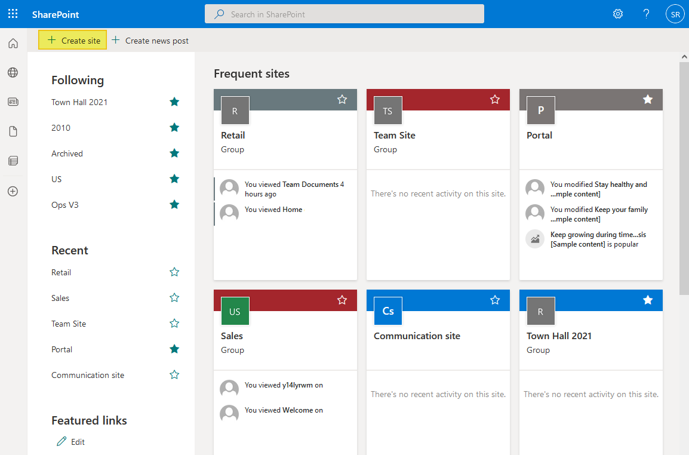
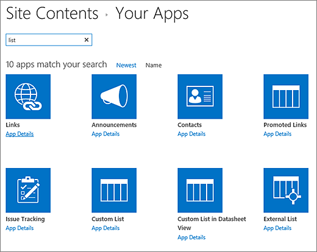
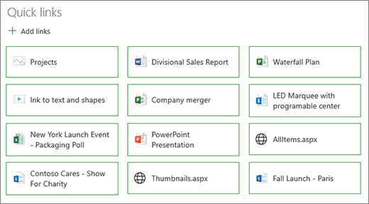
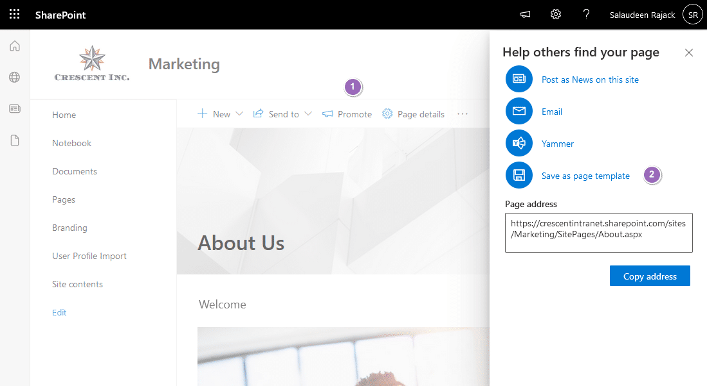
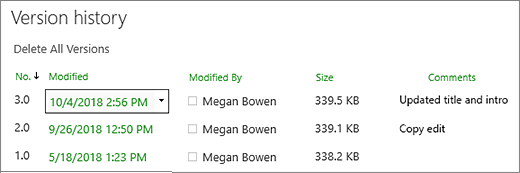
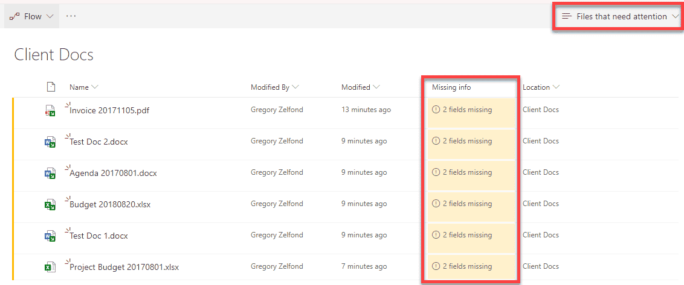
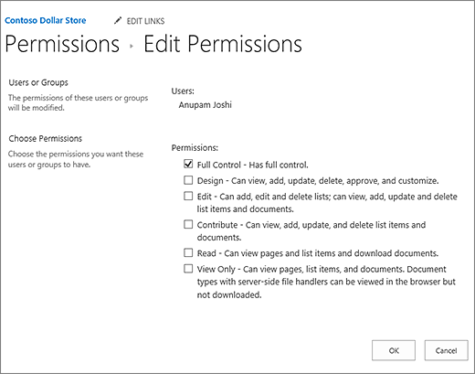

# SharePoint Online: Confluence-Style Project Documentation Setup Guide

**Version:** 1.0 | **Prepared by:** AINQA Internal | **Date:** April 2026

---

This guide provides a complete, step-by-step, copy-paste friendly procedure to configure **SharePoint Online** as a highly effective project documentation platform — mirroring the structure and usability of **Confluence Cloud**. Every section includes exact navigation paths, annotated screenshots, and ready-to-use content blocks.

---

## Phase 1: Establish the Information Architecture

The foundation of a Confluence-style experience in SharePoint relies on a clear separation between **Site Pages** (for content) and **Document Libraries** (for files). Before creating any content, the site structure must be designed intentionally.

### Step 1.1 — Create a Dedicated Communication Site

For project documentation, a **Communication Site** is preferred over a Team Site. It provides a cleaner, wider reading layout and does not create an unnecessary Microsoft 365 Group.

**Navigation Path:** SharePoint Home → `+ Create site` → Communication site

1. Open your SharePoint tenant home page:
   `https://[your-tenant].sharepoint.com`
2. Click **`+ Create site`** in the top-left corner.
3. When prompted, select **Communication site**.
4. Choose the **Topic** design template.
5. Enter the site name using this naming convention:
   `[Project Code] – Documentation`
   *(Example: `Project Phoenix – Documentation`)*
6. Enter a brief description (1–2 sentences about the project).
7. Click **Finish**.

> **Copy-paste ready site name format:**
> `[Project Code] – Documentation`



---

### Step 1.2 — Create Structured Document Libraries

Instead of storing all files in the default "Documents" library, create purpose-specific libraries. This mirrors Confluence's attachment organisation by space section.

**Navigation Path:** Site → Settings (Gear icon) → Site contents → `+ New` → Document library

Create the following five libraries in order:

| Library Name | Purpose |
|---|---|
| `01_Requirements` | Business and functional requirements documents |
| `02_Design` | Architecture diagrams, wireframes, design specs |
| `03_Testing` | Test plans, test cases, UAT sign-off sheets |
| `04_Deployment` | Runbooks, release notes, infrastructure configs |
| `99_Reference` | Third-party docs, vendor materials, standards |

For each library:
1. Click **`+ New`** → **Document library**.
2. Enter the library name exactly as shown above.
3. Click **Create**.



---

## Phase 2: Design the Home Page (The "Space Overview")

Your Home page replaces the Confluence left navigation panel and space overview. It must serve as the definitive entry point for all stakeholders.

### Step 2.1 — Edit the Home Page

**Navigation Path:** Site Home → `Edit` (top-right corner)

1. Navigate to the Home page of your new site.
2. Click **`Edit`** in the top-right corner.
3. Remove any default web parts that are not needed (e.g., Events, default News).
4. You will now build the page from scratch using the steps below.

---

### Step 2.2 — Add the Project Overview Text Block

1. Click the **`+`** icon to insert a new web part.
2. Select **Text**.
3. **Copy and paste** the following template into the text web part, then update the bracketed fields:

```
PROJECT OVERVIEW
━━━━━━━━━━━━━━━━━━━━━━━━━━━━━━━━━━━━━━━━━━━━━━━━

Project Name:    [Project Name]
Purpose:         [2–3 sentence description of the project goal]
Status:          [Active / On Hold / Completed]
Timeline:        [Start Date] – [End Date]
Project Owner:   [Full Name, Email]
Tech Lead:       [Full Name, Email]
Last Updated:    [Date]

━━━━━━━━━━━━━━━━━━━━━━━━━━━━━━━━━━━━━━━━━━━━━━━━
```

---

### Step 2.3 — Add the "Quick Links" Navigation Panel

This web part acts as the Confluence left-sidebar navigation, providing one-click access to all major documentation sections.

**Navigation Path:** Edit page → `+` → Quick Links

1. Click **`+`** to add a new web part.
2. Search for and select **Quick Links**.
3. In the web part settings panel (right side), change the layout to **List**.
4. Click **`+ Add links`** and add the following links (you will create these pages in Phase 3):

| Link Label | Target Page |
|---|---|
| Home | Site Home |
| Project Overview | `/SitePages/Project-Overview.aspx` |
| Requirements | `/SitePages/Requirements.aspx` |
| Architecture & Design | `/SitePages/Architecture.aspx` |
| Developer Guide | `/SitePages/Developer-Guide.aspx` |
| Testing & QA | `/SitePages/Testing-QA.aspx` |
| Deployment & Operations | `/SitePages/Deployment.aspx` |
| Decisions (ADRs) | `/SitePages/ADR-Log.aspx` |
| FAQ / Knowledge Base | `/SitePages/FAQ.aspx` |



5. Click **Republish** when done.

---

## Phase 3: Create Core Documentation Pages

Each page below mirrors a Confluence page in a project space. Follow this pattern for every page: **create → structure → link from Home**.

### Step 3.1 — Create a New Site Page

**Navigation Path:** Site → `+ New` → Site Page

1. From any page, click **`+ New`** in the top navigation bar.
2. Select **Site Page**.
3. Give the page a clear, searchable name using this convention:

> **Naming Convention:**
> `[Section] – [Topic]`
> Examples: `Architecture – High Level`, `API – Authentication`, `ADR – Database Selection`

4. Add the appropriate content using the templates below.

---

### Step 3.2 — Copy-Paste Page Templates

Use these templates by pasting them into the **Text** web part on each page.

#### Requirements Page Template

```
REQUIREMENTS
━━━━━━━━━━━━━━━━━━━━━━━━━━━━━━━━━━━━━━━━━━━━━━━━

Document ID:     REQ-[Number]
Version:         [1.0]
Status:          [Draft / Approved / Deprecated]
Owner:           [Name]
Last Reviewed:   [Date]

━━━━━━━━━━━━━━━━━━━━━━━━━━━━━━━━━━━━━━━━━━━━━━━━

BUSINESS OBJECTIVE
[Describe the business need this requirement addresses.]

FUNCTIONAL REQUIREMENTS
1. [Requirement 1]
2. [Requirement 2]
3. [Requirement 3]

NON-FUNCTIONAL REQUIREMENTS
- Performance: [e.g., Response time < 2 seconds]
- Security: [e.g., Role-based access control required]
- Availability: [e.g., 99.9% uptime SLA]

ACCEPTANCE CRITERIA
- [ ] [Criterion 1]
- [ ] [Criterion 2]

RELATED DOCUMENTS
- [Link to Design Doc]
- [Link to Test Plan]
```

---

#### Architecture Decision Record (ADR) Template

```
ARCHITECTURE DECISION RECORD
━━━━━━━━━━━━━━━━━━━━━━━━━━━━━━━━━━━━━━━━━━━━━━━━

ADR ID:          ADR-[Number]
Title:           ADR – [Decision Name]
Status:          [Proposed / Accepted / Deprecated / Superseded]
Date:            [YYYY-MM-DD]
Author:          [Name]

━━━━━━━━━━━━━━━━━━━━━━━━━━━━━━━━━━━━━━━━━━━━━━━━

CONTEXT
[Describe the situation and the problem that required a decision.]

DECISION
[State the decision that was made clearly and concisely.]

OPTIONS CONSIDERED
Option A: [Name]
  - Pros: [...]
  - Cons: [...]

Option B: [Name]
  - Pros: [...]
  - Cons: [...]

RATIONALE
[Explain why this option was chosen over the others.]

IMPACT
[Describe the consequences: technical, financial, timeline, team.]

SUPERSEDED BY (if applicable)
[Link to newer ADR if this one is deprecated]
```

---

#### How-To / Guideline Page Template

```
HOW-TO GUIDE
━━━━━━━━━━━━━━━━━━━━━━━━━━━━━━━━━━━━━━━━━━━━━━━━

Guide Title:     [Title]
Audience:        [Developers / QA / Operations / All]
Complexity:      [Beginner / Intermediate / Advanced]
Owner:           [Name]
Last Updated:    [Date]

━━━━━━━━━━━━━━━━━━━━━━━━━━━━━━━━━━━━━━━━━━━━━━━━

PURPOSE
[One paragraph explaining what this guide helps the reader accomplish.]

PRE-REQUISITES
- [Access / tool / knowledge required]
- [Access / tool / knowledge required]

STEP-BY-STEP PROCEDURE
Step 1: [Action]
  → [Expected result]

Step 2: [Action]
  → [Expected result]

Step 3: [Action]
  → [Expected result]

TROUBLESHOOTING
Issue: [Common problem]
Solution: [How to fix it]

RELATED PAGES
- [Link to related doc]
```

---

#### Meeting Notes Template

```
MEETING NOTES
━━━━━━━━━━━━━━━━━━━━━━━━━━━━━━━━━━━━━━━━━━━━━━━━

Meeting Title:   [Title]
Date & Time:     [YYYY-MM-DD, HH:MM]
Location:        [Teams / Room / Call]
Facilitator:     [Name]
Note-taker:      [Name]
Attendees:       [Name 1, Name 2, Name 3]

━━━━━━━━━━━━━━━━━━━━━━━━━━━━━━━━━━━━━━━━━━━━━━━━

AGENDA
1. [Topic 1]
2. [Topic 2]
3. [Topic 3]

DISCUSSION SUMMARY
[Topic 1]: [Summary of what was discussed]
[Topic 2]: [Summary of what was discussed]

DECISIONS MADE
- [Decision 1]
- [Decision 2]

ACTION ITEMS
| # | Action | Owner | Due Date | Status |
|---|--------|-------|----------|--------|
| 1 | [Action] | [Name] | [Date] | Open |
| 2 | [Action] | [Name] | [Date] | Open |

NEXT MEETING
Date: [YYYY-MM-DD]
```

---

### Step 3.3 — Save a Page as a Template

Once you have created and formatted a page, save it as a reusable template so all team members can use it.

**Navigation Path:** Page in Edit mode → Page details (right panel) → `Save as template`

1. Open the page you want to save as a template.
2. Click **`Edit`**.
3. In the right-hand panel, click **`Page details`**.
4. Scroll down and click **`Save as template`**.
5. The template will now appear when any team member clicks **`+ New`** → **Site Page**.



---

## Phase 4: Configure Versioning and Metadata

### Step 4.1 — Enable Version History on Site Pages

**Navigation Path:** Site contents → Site Pages → Library settings → Versioning settings

1. Go to **Settings** (Gear icon) → **Site contents**.
2. Click **Site Pages**.
3. Click the **Gear icon** → **Library settings** → **More library settings**.
4. Click **Versioning settings**.
5. Under **Document Version History**, select:
   - **Create major versions**: Yes
   - **Keep the following number of major versions**: `50`
6. Click **OK**.



> **Best Practice:** Always add a brief change summary at the top of a page when making significant edits. Use the format: `[Date] – [Your Name]: [What changed]`

---

### Step 4.2 — Add Metadata Columns to Document Libraries

**Navigation Path:** Document Library → `+ Add column` → Choice

For each document library, add the following metadata columns:

| Column Name | Type | Choices |
|---|---|---|
| `Document Type` | Choice | Requirement, Design, Runbook, Test Plan, API Spec |
| `Module / System` | Choice | [Your project's modules] |
| `Audience` | Choice | Business, Development, Operations, All |
| `Status` | Choice | Draft, In Review, Approved, Deprecated |

To add each column:
1. Open the document library.
2. Click **`+ Add column`** (far right of the column headers).
3. Select **Choice**.
4. Enter the column name and choices as listed above.
5. Click **Save**.



---

## Phase 5: Configure Access and Permissions

### Step 5.1 — Assign Users to Permission Groups

**Navigation Path:** Settings (Gear icon) → Site permissions → Share site

SharePoint has three default permission groups. Use them as follows:

| Group | Permission Level | Who to Add |
|---|---|---|
| **Site Owners** | Full Control | Project Manager, Tech Lead, Documentation Owner |
| **Site Members** | Edit | Developers, QA Engineers, Business Analysts, Scrum Master |
| **Site Visitors** | Read Only | Business Stakeholders, Executives, Auditors |

To add a user:
1. Click the **Gear icon** → **Site permissions**.
2. Click **Share site**.
3. Enter the user's name or email.
4. Select the appropriate permission group from the dropdown.
5. Optionally uncheck "Send email" if you prefer to notify them manually.
6. Click **Add**.



> **Important:** Avoid setting page-level or library-level permissions unless absolutely required for sensitive content. Group-level permissions are far easier to manage.

---

## Phase 6: Integrate with Microsoft Teams

Connecting your SharePoint site to Microsoft Teams ensures the documentation is always one click away during daily work.

### Step 6.1 — Pin the SharePoint Home Page as a Teams Tab

1. Open your project's **Microsoft Teams channel**.
2. Click the **`+`** icon next to the channel tabs at the top.
3. Search for and select **SharePoint**.
4. Choose **Add a page from any SharePoint site**.
5. Paste the URL of your documentation Home page.
6. Name the tab (e.g., "Project Docs").
7. Click **Save**.

### Step 6.2 — Post the Documentation Link in the Channel

Copy and paste this announcement message into your Teams channel:

```
📚 Project Documentation Hub is now live!

All project documentation, requirements, design decisions, and runbooks 
are now centralised in our SharePoint site:

🔗 [Paste your SharePoint site URL here]

Quick links:
📄 Requirements → [URL]
🧱 Architecture → [URL]
🛠 Developer Guide → [URL]
📋 ADR Log → [URL]

Please bookmark this site and use it as your primary reference.
Questions? Contact [Project Owner Name].
```

---

## Phase 7: Enforce Documentation Culture

Tools alone do not create good documentation. The following rules must be agreed upon by the team and enforced during sprint ceremonies.

| Rule | How to Enforce |
|---|---|
| No feature is complete without a documentation page | Add "Documentation Updated" as a Definition of Done item |
| Every page must have a named owner | Add an "Owner" field to every page template |
| Review and update docs during Sprint Review | Add a "Docs Review" agenda item to Sprint Review |
| Outdated pages must be clearly labelled | Add `[DEPRECATED]` to the page title and a notice at the top |
| Old projects must be archived | Move completed project sites to a dedicated "Archive" hub |

---

## Quick-Start Checklist for New Projects

Use this checklist every time a new project documentation site is created.

```
SHAREPOINT PROJECT DOCUMENTATION – SETUP CHECKLIST
━━━━━━━━━━━━━━━━━━━━━━━━━━━━━━━━━━━━━━━━━━━━━━━━

SITE SETUP
[ ] Create Communication Site named "[Project Code] – Documentation"
[ ] Delete default unnecessary web parts from Home page
[ ] Add Quick Links navigation web part to Home page
[ ] Add Project Overview text block to Home page

DOCUMENT LIBRARIES
[ ] Create 01_Requirements library
[ ] Create 02_Design library
[ ] Create 03_Testing library
[ ] Create 04_Deployment library
[ ] Create 99_Reference library
[ ] Add metadata columns (Document Type, Audience, Status) to each library

PAGES
[ ] Create and publish: Project Overview page
[ ] Create and publish: Requirements page
[ ] Create and publish: Architecture & Design page
[ ] Create and publish: Developer Guide page
[ ] Create and publish: Testing & QA page
[ ] Create and publish: Deployment & Operations page
[ ] Create and publish: ADR Log page
[ ] Create and publish: FAQ / Knowledge Base page
[ ] Save ADR, Requirements, and Meeting Notes pages as Templates

VERSIONING & GOVERNANCE
[ ] Enable major version history on Site Pages library (keep 50 versions)
[ ] Enable major version history on all Document Libraries

PERMISSIONS
[ ] Add Project Manager and Tech Lead to Site Owners
[ ] Add project team (devs, QA, BAs) to Site Members
[ ] Add stakeholders and business users to Site Visitors

MICROSOFT TEAMS INTEGRATION
[ ] Pin SharePoint Home page as a tab in the project Teams channel
[ ] Post documentation hub announcement in Teams channel

━━━━━━━━━━━━━━━━━━━━━━━━━━━━━━━━━━━━━━━━━━━━━━━━
Completed by: ________________  Date: ___________
```

---

*This guide was prepared for internal use by AINQA Internal. For questions or updates, contact the project documentation owner.*
