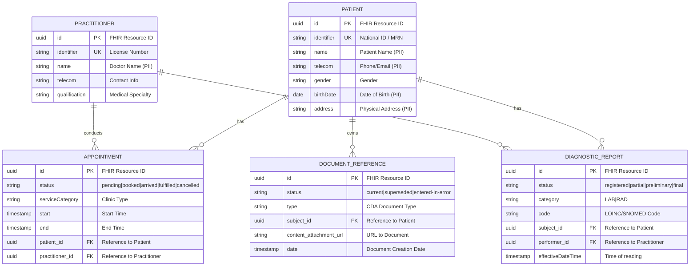

# Data Model: Integration Strategy & SMILE CDR Migration

> **Template Origin**: Official | **ArcKit Version**: 1.0.0 | **Command**: `$arckit-data-model`

## Document Control

| Field | Value |
|-------|-------|
| **Document ID** | ARC-001-DATA-v1.0 |
| **Document Type** | Data Model |
| **Project** | Integration Strategy & SMILE CDR Migration (Project 001) |
| **Classification** | OFFICIAL-SENSITIVE |
| **Status** | DRAFT |
| **Version** | 1.0 |
| **Created Date** | 2026-04-19 |
| **Last Modified** | 2026-04-19 |
| **Review Cycle** | Quarterly |
| **Next Review Date** | 2026-05-19 |
| **Owner** | Project Manager |
| **Reviewed By** | [PENDING] |
| **Approved By** | [PENDING] |
| **Distribution** | Project Team, Architecture Team, PSMMC Stakeholders |

## Revision History

| Version | Date | Author | Changes | Approved By | Approval Date |
|---------|------|--------|---------|-------------|---------------|
| 1.0 | 2026-04-19 | ArcKit AI | Initial creation from `$arckit-data-model` command | [PENDING] | [PENDING] |

---

## Executive Summary

### Overview

This data model defines the core FHIR R4 entities required for the Integration Strategy and SMILE CDR Migration project at PSMMC. It maps the data requirements derived from the NPHIES and Mawid integrations, specifically focusing on the Practitioner, Patient, Appointment, and Clinical Document domains. This model will guide the ETL migration from the legacy Cerner Millenium (Oracle DB v11) system into the new FHIR-native SMILE CDR repository.

### Model Statistics

- **Total Entities**: 5 entities defined (E-001 through E-005)
- **Total Attributes**: 29 attributes across all entities
- **Total Relationships**: 5 relationships mapped
- **Data Classification**:
  - 🟢 Public: 0 entities
  - 🟡 Internal: 1 entity (Practitioner)
  - 🟠 Confidential: 0 entities
  - 🔴 Restricted: 4 entities (Patient, Appointment, DiagnosticReport, DocumentReference - all contain PHI/PII)

### Compliance Summary

- **GDPR/DPA 2018 Status**: NEEDS_DPIA
- **PII Entities**: 4 entities contain personally identifiable information (PHI)
- **Data Protection Impact Assessment (DPIA)**: REQUIRED
- **Data Retention**: 7+ years (driven by healthcare regulations)
- **Cross-Border Transfers**: NO (All data must remain within KSA)

### Key Data Governance Stakeholders

- **Data Owner (Business)**: Ayman (PSMMC) - Accountable for data quality and usage
- **Data Steward**: Asma (PSMMC) - Responsible for data governance policies
- **Data Custodian (Technical)**: Fawaz / Hanan (PSMMC) - Manages data storage and security
- **Data Protection Officer**: [PENDING] - Ensures privacy compliance

---

## Visual Entity-Relationship Diagram (ERD)

---

## Entity Catalog

### Entity E-001: PATIENT

**Description**: Represents the demographic and administrative data of a patient migrating from the legacy HIS/EMR to SMILE CDR.

**Source Requirements**:
- DR-1: Legacy Data Migration

**Data Ownership**:
- **Business Owner**: Ayman
- **Technical Owner**: Fawaz / Hanan

**Data Classification**: RESTRICTED (Contains PHI)

#### Attributes

| Attribute | Type | Required | PII | Description | Validation Rules | Source Req |
|-----------|------|----------|-----|-------------|------------------|------------|
| id | UUID | Yes | No | FHIR Resource ID | UUID v4 | DR-1 |
| identifier | String | Yes | Yes | National ID or MRN | Unique per patient | DR-1 |
| name | String | Yes | Yes | Full Name | Non-empty | DR-1 |
| telecom | String | No | Yes | Phone or Email | E.164 / RFC 5322 | DR-1 |
| gender | String | Yes | No | Gender | male/female/other/unknown | DR-1 |
| birthDate | Date | Yes | Yes | Date of Birth | YYYY-MM-DD | DR-1 |
| address | String | No | Yes | Physical Address | Valid address string | DR-1 |

---

### Entity E-002: PRACTITIONER

**Description**: Represents a healthcare professional (doctor, nurse) providing services. Critical for fixing the Mawid integration.

**Source Requirements**:
- BR-1: Complete Mawid Integration (Practitioner Lookup)
- FR-1: FHIR R4 KSA Translation

**Data Ownership**:
- **Business Owner**: Asma
- **Technical Owner**: Julnishar / Aman

**Data Classification**: INTERNAL

#### Attributes

| Attribute | Type | Required | PII | Description | Validation Rules | Source Req |
|-----------|------|----------|-----|-------------|------------------|------------|
| id | UUID | Yes | No | FHIR Resource ID | UUID v4 | FR-1 |
| identifier | String | Yes | No | License/Staff ID | Unique per staff | FR-1 |
| name | String | Yes | Yes | Practitioner Name | Non-empty | FR-1 |
| telecom | String | No | No | Work Contact | Valid format | FR-1 |
| qualification | String | Yes | No | Specialty Code | Valid code system | FR-1 |

---

### Entity E-003: APPOINTMENT

**Description**: Represents a booking for a healthcare event, specifically used by the Mawid (Lean/Eatizaz) integration.

**Source Requirements**:
- BR-1: Complete Mawid Integration
- INT-1: Mawid Integration

**Data Ownership**:
- **Business Owner**: Ayman
- **Technical Owner**: Julnishar / Aman

**Data Classification**: RESTRICTED

#### Attributes

| Attribute | Type | Required | PII | Description | Validation Rules | Source Req |
|-----------|------|----------|-----|-------------|------------------|------------|
| id | UUID | Yes | No | FHIR Resource ID | UUID v4 | INT-1 |
| status | String | Yes | No | Booking status | valid FHIR status | INT-1 |
| serviceCategory | String | Yes | No | Type of clinic | Valid code | INT-1 |
| start | Timestamp | Yes | No | Start time | ISO 8601 | INT-1 |
| end | Timestamp | Yes | No | End time | ISO 8601, > start | INT-1 |
| patient_id | UUID | Yes | No | Patient Ref | Valid FK | INT-1 |
| practitioner_id | UUID | Yes | No | Doc Ref | Valid FK | INT-1 |

---

### Entity E-004: DIAGNOSTIC_REPORT

**Description**: Represents findings and interpretations of diagnostic tests (Lab, Rad) for NPHIES integration.

**Source Requirements**:
- BR-2: Complete NPHIES Integration
- INT-2: NPHIES Integration

**Data Ownership**:
- **Business Owner**: Ayman
- **Technical Owner**: Ashique

**Data Classification**: RESTRICTED

#### Attributes

| Attribute | Type | Required | PII | Description | Validation Rules | Source Req |
|-----------|------|----------|-----|-------------|------------------|------------|
| id | UUID | Yes | No | FHIR Resource ID | UUID v4 | INT-2 |
| status | String | Yes | No | Report status | valid FHIR status | INT-2 |
| category | String | Yes | No | LAB or RAD | LAB/RAD | INT-2 |
| code | String | Yes | No | Procedure code | LOINC/SNOMED | INT-2 |
| subject_id | UUID | Yes | No | Patient Ref | Valid FK | INT-2 |
| performer_id | UUID | Yes | No | Doc Ref | Valid FK | INT-2 |
| effectiveDateTime | Timestamp | Yes | No | Date of reading | ISO 8601 | INT-2 |

---

### Entity E-005: DOCUMENT_REFERENCE

**Description**: A reference to a clinical document (e.g., CDA) required for NPHIES integration.

**Source Requirements**:
- BR-2: Complete NPHIES Integration
- FR-2: CDA Document Retrieval

**Data Ownership**:
- **Business Owner**: Ayman
- **Technical Owner**: Ashique

**Data Classification**: RESTRICTED

#### Attributes

| Attribute | Type | Required | PII | Description | Validation Rules | Source Req |
|-----------|------|----------|-----|-------------|------------------|------------|
| id | UUID | Yes | No | FHIR Resource ID | UUID v4 | FR-2 |
| status | String | Yes | No | Document status | current/superseded | FR-2 |
| type | String | Yes | No | CDA Doc Type | Valid code | FR-2 |
| subject_id | UUID | Yes | No | Patient Ref | Valid FK | FR-2 |
| content_attachment_url| String | Yes | No | Path to CDA | Valid URI | FR-2 |
| date | Timestamp | Yes | No | Creation Date | ISO 8601 | FR-2 |

---

## Data Governance Matrix

| Entity | Business Owner | Data Steward | Technical Custodian | Sensitivity | Compliance | Quality SLA | Access Control |
|--------|----------------|--------------|---------------------|-------------|------------|-------------|----------------|
| PATIENT | Ayman | Asma | Fawaz/Hanan | RESTRICTED | NPHIES/MOH | 99% accuracy | Auth Users Only |
| PRACTITIONER | Asma | Asma | Julnishar/Aman | INTERNAL | NPHIES/MOH | 99% accuracy | Public/Internal |
| APPOINTMENT | Ayman | Asma | Julnishar/Aman | RESTRICTED | NPHIES/MOH | 99% accuracy | Patient/Doc/Admin |
| DIAGNOSTIC_REP | Ayman | Asma | Ashique | RESTRICTED | NPHIES/MOH | 99% accuracy | Patient/Doc/Admin |
| DOCUMENT_REF | Ayman | Asma | Ashique | RESTRICTED | NPHIES/MOH | 99% accuracy | Patient/Doc/Admin |

---

## CRUD Matrix

| Entity | Mawid (Lean) | NPHIES | Rhapsody | Legacy HIS (ETL) |
|--------|--------------|--------|----------|------------------|
| PATIENT | -R-- | -R-- | -R-- | CR-- |
| PRACTITIONER | -R-- | -R-- | -R-- | CR-- |
| APPOINTMENT | CRUD | -R-- | CR-- | CR-- |
| DIAGNOSTIC_REP | ---- | CR-- | CR-- | CR-- |
| DOCUMENT_REF | ---- | CR-- | CR-- | CR-- |

---

## Data Integration Mapping

### Upstream Systems (Data Sources)

**Integration INT-001: Legacy Cerner Millenium (Oracle DB v11)**
- **Integration Type**: Batch ETL to SMILE CDR
- **Data Flow Direction**: Cerner → SMILE CDR
- **Entities Affected**: Patient, Practitioner, DiagnosticReport, DocumentReference
- **Update Frequency**: One-time initial load, then incremental sync until decommissioning.

**Integration INT-002: Mawid (Eatizaz)**
- **Integration Type**: Real-time API
- **Data Flow Direction**: Mawid → Rhapsody → Cerner/SMILE CDR
- **Entities Affected**: Appointment
- **Update Frequency**: Real-time via FHIR R4 KSA API.

### Downstream Systems (Data Consumers)

**Integration INT-101: NPHIES**
- **Integration Type**: Real-time API
- **Data Flow Direction**: Rhapsody → NPHIES
- **Entities Affected**: Patient, DiagnosticReport, DocumentReference
- **Sync Method**: XDS/FHIR push/pull

---

## Privacy & Compliance

### PII / PHI Inventory

**Entities Containing PHI/PII**:
- PATIENT: name, identifier, telecom, birthDate, address
- PRACTITIONER: name
- APPOINTMENT: implicitly links to PHI via patient_id
- DIAGNOSTIC_REPORT: implicitly links to PHI, code
- DOCUMENT_REFERENCE: implicitly links to PHI, attachment

### Data Protection Impact Assessment (DPIA)

**DPIA Required**: YES (Large-scale processing of special category health data)
**Status**: REQUIRED
**Mitigation Measures**:
- AES-256 Encryption at rest in SMILE CDR.
- TLS 1.3 encryption in transit for Rhapsody DMZ.
- Strict RBAC per MOH regulations.

### KSA MOH / NPHIES Compliance
- **Data Residency**: All patient data must reside in KSA.
- **NPHIES QNR Conformance**: Mandatory testing to be completed using SMILE CDR.

---

**Generated by**: ArcKit `$arckit-data-model` command
**Generated on**: 2026-04-19
**ArcKit Version**: 1.0.0
**Project**: Integration Strategy & SMILE CDR Migration (Project 001)
**AI Model**: Gemini 3.1 Pro (High)
