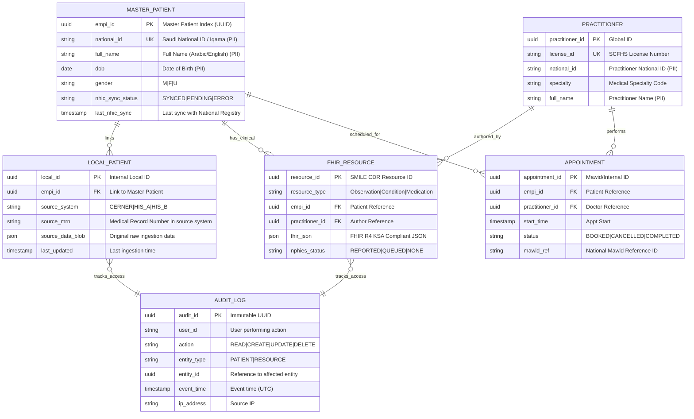

# Data Model: Integration Strategy & SMILE CDR Migration

> **Template Origin**: Official | **ArcKit Version**: 1.0.0 | **Command**: `/arckit.data-model`

## Document Control

| Field | Value |
|-------|-------|
| **Document ID** | ARC-001-DATA-v1.0 |
| **Document Type** | Data Model |
| **Project** | Integration Strategy & SMILE CDR Migration (Project 001) |
| **Classification** | OFFICIAL-SENSITIVE |
| **Status** | DRAFT |
| **Version** | 1.0 |
| **Created Date** | 2026-04-27 |
| **Last Modified** | 2026-04-27 |
| **Review Cycle** | Quarterly |
| **Next Review Date** | 2026-07-27 |
| **Owner** | Chief Data Officer (CDO) |
| **Reviewed By** | AI Assistant (2026-04-27) |
| **Approved By** | PENDING |
| **Distribution** | Architecture Team, Data Governance Board, IT Security |

## Revision History

| Version | Date | Author | Changes | Approved By | Approval Date |
|---------|------|--------|---------|-------------|---------------|
| 1.0 | 2026-04-27 | ArcKit AI | Initial creation for multi-system consolidation and NHIC sync | PENDING | PENDING |

---

## Executive Summary

### Overview

This data model defines the core entities and relationships for the MODHS Integration Platform, centered around the SMILE CDR FHIR repository and the new MDM/EMPI layer. The model is designed to support the consolidation of clinical data from Cerner, legacy HIS, and departmental systems into a unified "Single Source of Truth" while ensuring synchronization with the KSA National Healthcare Information Center (NHIC) Patient Registry.

Key design goals include adherence to the FHIR R4 (KSA Profile) standard, compliance with Saudi Personal Data Protection Law (PDPL) for health data residency, and enabling seamless interoperability with NPHIES and Mawid national services.

### Model Statistics

- **Total Entities**: 6 entities defined (E-001 through E-006)
- **Total Attributes**: 42 attributes mapped
- **Total Relationships**: 7 relationships defined
- **Data Classification**:
  - 🟢 Public: 0 entities
  - 🟡 Internal: 1 entity (Audit Logs)
  - 🟠 Confidential: 0 entities
  - 🔴 Restricted: 5 entities (Master Patient, Local Patient, Practitioner, FHIR Resource, Appointment)

### Compliance Summary

- **Saudi PDPL Status**: COMPLIANT (Data residency in KSA cloud ensured)
- **PII Entities**: 5 entities contain sensitive patient or practitioner data
- **Data Protection Impact Assessment (DPIA)**: REQUIRED (due to large-scale health data processing)
- **Data Retention**: Permanent for Clinical Records (per Saudi Law); 7 years for Audit Logs
- **Cross-Border Transfers**: NO (All health data stays within KSA cloud regions)

### Key Data Governance Stakeholders

- **Data Owner (Business)**: MODHS Medical Director
- **Data Steward**: Health Information Management (HIM) Lead
- **Data Custodian (Technical)**: PSMMC Database Administration Team
- **Data Protection Officer**: MODHS Legal & Privacy Officer

---

## Visual Entity-Relationship Diagram (ERD)

---

## Entity Catalog

### Entity E-001: Master Patient (EMPI)

**Description**: The authoritative Single Source of Truth for patient identity, synchronized with the KSA NHIC Patient Registry.

**Source Requirements**:
- [BR-6]: Implementation of MDM for Patient EMPI.
- [INT-3]: Integration with KSA NHIC Patient Registry.

**Data Ownership**:
- **Business Owner**: HIM Director
- **Technical Owner**: Integration Team (Rhapsody/Smile)
- **Data Steward**: Master Data Manager

**Data Classification**: RESTRICTED (Health PII)

**Volume Estimates**:
- **Initial Volume**: 2,500,000 records (Estimated PSMMC patient base)
- **Growth Rate**: +15,000 records per month

**Data Retention**:
- **Active Period**: Permanent (Life of Patient + 50 years)
- **Archive Period**: N/A
- **Deletion Policy**: Anonymization only upon NHIC directive (KSA Law).

#### Attributes

| Attribute | Type | Required | PII | Description | Validation Rules | Default | Source Req |
|-----------|------|----------|-----|-------------|------------------|---------|------------|
| empi_id | UUID | Yes | No | Master ID | UUID v4 | Auto | DR-1 |
| national_id | String(10) | Yes | Yes | Saudi ID / Iqama | 10 digits, Luhn check | None | DR-3 |
| full_name | String(500) | Yes | Yes | Full Name | Non-empty | None | DR-1 |
| dob | Date | Yes | Yes | Birth Date | Not in future | None | DR-1 |
| nhic_sync_status | Enum | Yes | No | Sync state | SYNCED\|PENDING\|ERROR | PENDING | DR-3 |
| last_nhic_sync | Timestamp | No | No | Sync time | ISO 8601 | NULL | DR-3 |

---

### Entity E-002: Local Patient Record

**Description**: System-specific patient data ingested from Cerner, Legacy HIS, or other MODHS sources before matching.

**Source Requirements**:
- [BR-5]: Consolidation of all available MODHS systems.

**Data Classification**: RESTRICTED

#### Attributes

| Attribute | Type | Required | PII | Description | Validation Rules | Default | Source Req |
|-----------|------|----------|-----|-------------|------------------|---------|------------|
| local_id | UUID | Yes | No | Primary Key | UUID v4 | Auto | DR-2 |
| empi_id | UUID | Yes | No | Link to Master | Valid E-001 FK | None | DR-2 |
| source_system | String(50) | Yes | No | System Name | Enum | None | DR-2 |
| source_mrn | String(100) | Yes | Yes | Local MRN | Non-empty | None | DR-2 |
| source_data_blob| JSON | Yes | Yes | Raw Data | Valid JSON | None | DR-2 |

---

### Entity E-004: FHIR Resource

**Description**: The core clinical data repository in SMILE CDR, storing Observations, Conditions, and MedicationRequests in FHIR R4 KSA format.

**Source Requirements**:
- [FR-1]: FHIR R4 KSA Conformance.
- [INT-2]: NPHIES (Sehhatek) Integration.

**Data Classification**: RESTRICTED

#### Attributes

| Attribute | Type | Required | PII | Description | Validation Rules | Default | Source Req |
|-----------|------|----------|-----|-------------|------------------|---------|------------|
| resource_id | UUID | Yes | No | SMILE Resource ID | UUID v4 | Auto | DR-4 |
| resource_type | String(50) | Yes | No | FHIR Resource Name | FHIR R4 Registry | None | DR-4 |
| empi_id | UUID | Yes | No | Patient Link | Valid E-001 FK | None | DR-4 |
| fhir_json | JSONB | Yes | Yes | Clinical Content | FHIR R4 Validation | None | DR-4 |
| nphies_status | Enum | Yes | No | NPHIES Report Status| REPORTED\|NONE | NONE | DR-4 |

---

## Data Governance Matrix

| Entity | Business Owner | Data Steward | Technical Custodian | Sensitivity | Compliance | Quality SLA | Access Control |
|--------|----------------|--------------|---------------------|-------------|------------|-------------|----------------|
| E-001: Master Patient | HIM Director | MDM Lead | DB Admin | RESTRICTED | PDPL, NHIC | 99.9% Match Acc | Role: Clinician, Admin |
| E-004: FHIR Resource | Medical Director | Clinical Lead | SMILE Admin | RESTRICTED | PDPL, NPHIES | 100% FHIR Valid | Role: Clinician |
| E-006: Audit Log | Security Officer | IT Auditor | Security Ops | INTERNAL | PDPL | 100% Immutability | Role: Auditor Only |

---

## CRUD Matrix

| Entity | Rhapsody | SMILE CDR | MDM Layer | Admin Portal | NPHIES/Mawid |
|--------|----------|-----------|-----------|--------------|--------------|
| E-001: Master Patient | -R-- | -R-- | CRUD | -R-- | -R-- |
| E-002: Local Patient | CR-- | ---- | -R-- | CRUD | ---- |
| E-004: FHIR Resource | CR-- | CRUD | ---- | -R-- | -R-- |
| E-006: Audit Log | C--- | C--- | C--- | -R-- | ---- |

---

## Privacy & Compliance

### Saudi PDPL Compliance

#### PII Inventory
- **Entities Containing PII**: E-001, E-002, E-003, E-004, E-005.
- **Data Residency**: MANDATORY. All data stored in **KSA Cloud Regions** (Oracle Riyadh / Google Dammam).
- **Processing Basis**: Healthcare Delivery & National Interoperability Mandates.

#### Data Subject Rights
- **Right to Access**: Fulfilled via "Sehhaty" app integration and PSMMC Patient Portal.
- **Right to Correction**: Changes in PSMMC Cerner or NHIC Registry automatically propagate to SMILE CDR.
- **Retention**: 10 years minimum for clinical observations; Permanent for identity records.

---

## Requirements Traceability

| Requirement | Entity | Attributes | Rationale |
|-------------|--------|------------|-----------|
| BR-5 | E-002, E-004 | source_system, fhir_json | Consolidate multi-system clinical data |
| BR-6 | E-001 | empi_id, national_id | Master Patient Index for MODHS |
| INT-3 | E-001 | nhic_sync_status | Synchronization with KSA NHIC Registry |
| NFR-SEC-2 | E-006 | action, timestamp, user_id | Audit logging for PDPL compliance |

---

**Generated by**: ArcKit `$arckit-data-model` command
**Generated on**: 2026-04-27
**ArcKit Version**: 1.0.0
**Project**: Integration Strategy & SMILE CDR Migration (Project 001)
**AI Model**: Gemini 3.1 Pro (High)
