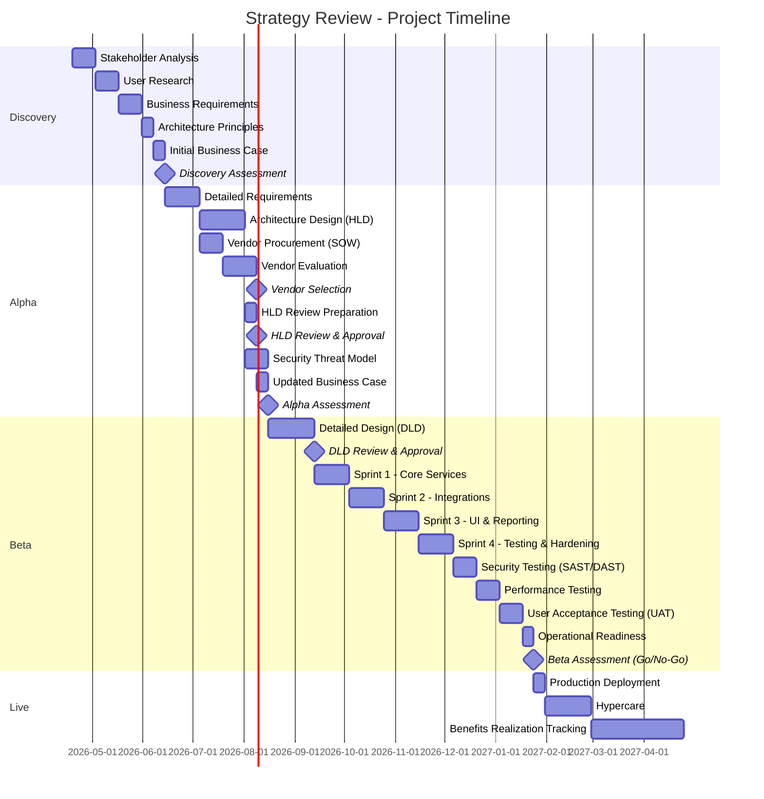
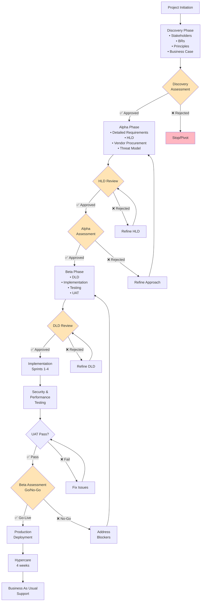

# Project Plan: Strategy Review

> **Template Origin**: Official | **ArcKit Version**: 1.0.0 | **Command**: `$arckit-plan`

## Document Control

| Field | Value |
|-------|-------|
| **Document ID** | ARC-001-PLAN-v1.0 |
| **Document Type** | Project Plan |
| **Project** | Strategy Review (Project 001) |
| **Classification** | OFFICIAL |
| **Status** | DRAFT |
| **Version** | 1.0 |
| **Created Date** | 2026-04-19 |
| **Last Modified** | 2026-04-19 |
| **Review Cycle** | Quarterly |
| **Next Review Date** | 2026-05-19 |
| **Owner** | Project Manager |
| **Reviewed By** | [PENDING] |
| **Approved By** | [PENDING] |
| **Distribution** | Project Team, Architecture Team |

## Revision History

| Version | Date | Author | Changes | Approved By | Approval Date |
|---------|------|--------|---------|-------------|---------------|
| 1.0 | 2026-04-19 | ArcKit AI | Initial creation from `$arckit-plan` command | PENDING | PENDING |

---

## Executive Summary

**Project**: Strategy Review
**Duration**: 6-12 months (Medium Complexity)
**Budget**: £[PENDING]
**Team**: [PENDING] FTE average
**Delivery Model**: Hybrid (Agile delivery within waterfall governance gates)

**Objective**: Comprehensive strategy and governance review for MODHS.

**Success Criteria**:

- Strategy alignment achieved across major stakeholders
- Clear governance gates established and approved
- Risk register mitigations actively managed
- Vendor evaluation framework defined and executed

**Key Milestones**:

- Discovery Complete: Week 6
- Alpha Complete (HLD & Vendor Selection approved): Week 16
- Beta Complete (Go-Live approved): Week 32
- Production Launch: Week 33

---

## Timeline Overview (Gantt Chart)

---

## Workflow & Gates Diagram

---

## Discovery Phase (Weeks 1-6)

**Objective**: Validate problem and approach

### Activities & Timeline

| Week | Activity | ArcKit Command | Deliverable |
|------|----------|----------------|-------------|
| 1-2 | Stakeholder Analysis | `$arckit-stakeholders` | Stakeholder map, drivers, goals |
| 3-4 | User Research | Manual | User needs, pain points |
| 5-6 | Business Requirements | `$arckit-requirements` | BRs with acceptance criteria |
| 7 | Architecture Principles | `$arckit-principles` | 10-15 principles |
| 8 | Initial Business Case | `$arckit-sobc` | Cost/benefit analysis |
| 8 | Initial Risk Register | `$arckit-risk` | Top 10 risks |

### Gate: Discovery Assessment (Week 8)

**Approval Criteria**:

- [ ] Problem clearly defined and validated
- [ ] User needs documented
- [ ] Business Requirements defined (15-25 BRs)
- [ ] Architecture principles agreed
- [ ] Business case shows positive ROI
- [ ] No critical risks without mitigation
- [ ] Stakeholder buy-in confirmed

**Approvers**: SRO, Architecture Board

**Possible Outcomes**:

- ✅ **Go to Alpha** - Problem validated, approach feasible
- 🔄 **Pivot** - Adjust approach based on findings
- ❌ **Stop** - Problem not worth solving or approach not feasible

---

## Alpha Phase (Weeks 9-16)

**Objective**: Design the solution and validate approach

### Activities & Timeline

| Week | Activity | ArcKit Command | Deliverable |
|------|----------|----------------|-------------|
| 9-11 | Detailed Requirements | `$arckit-requirements` | FR, NFR, INT, DR |
| 10-12 | Data Model | `$arckit-data-model` | Entity relationships |
| 11-14 | Architecture Design | `$arckit-diagram` | HLD with C4 diagrams |
| 11-13 | Generate SOW/RFP | `$arckit-sow` | Vendor procurement docs |
| 14-16 | Vendor Evaluation | `$arckit-evaluate` | Scoring matrix |
| 16 | Security Threat Model | Manual | STRIDE analysis |
| 17 | HLD Review | `$arckit-hld-review` | HLD approval |
| 18 | Updated Business Case | `$arckit-sobc` | Revised costs |

### Gate: HLD Review (Week 17)

**Approval Criteria**:

- [ ] All MUST requirements addressed in design
- [ ] Architecture principles compliant
- [ ] Security architecture defined
- [ ] Integration approach documented
- [ ] Performance approach documented
- [ ] No unmitigated high risks

**Approvers**: Architecture Board, Security Lead

### Gate: Alpha Assessment (Week 18)

**Approval Criteria**:

- [ ] HLD approved
- [ ] Vendor selected (if applicable)
- [ ] Business case updated with accurate costs
- [ ] Team and budget confirmed for Beta
- [ ] Technical feasibility demonstrated

**Approvers**: SRO, Architecture Board, Finance

**Possible Outcomes**:

- ✅ **Go to Beta** - Design validated, ready to build
- 🔄 **Iterate** - Refine design based on feedback
- ❌ **Stop** - Approach not feasible or business case negative

---

## Beta Phase (Weeks 19-32)

**Objective**: Build, test, and prepare for live

### Activities & Timeline

| Week | Activity | ArcKit Command | Deliverable |
|------|----------|----------------|-------------|
| 19-22 | Detailed Design (DLD) | Manual | DLD document |
| 23 | DLD Review | `$arckit-dld-review` | DLD approval |
| 24-26 | Sprint 1 - Core Services | Manual | Working software |
| 27-29 | Sprint 2 - Integrations | Manual | Integrated system |
| 30-32 | Sprint 3 - UI & Reporting | Manual | User interface |
| 33-35 | Sprint 4 - Hardening | Manual | Production-ready code |
| 36-37 | Security Testing | Manual | SAST/DAST results |
| 38-39 | Performance Testing | Manual | Load test results |
| 40-41 | UAT | Manual | User sign-off |
| 42 | Operational Readiness | `$arckit-operationalize` | Runbooks, DR plan |
| 42 | Quality Analysis | `$arckit-analyze` | Final quality check |

### Gate: DLD Review (Week 23)

**Approval Criteria**:

- [ ] DLD aligns with approved HLD
- [ ] All implementation details documented
- [ ] Security controls specified
- [ ] Test strategy defined
- [ ] Deployment approach documented

**Approvers**: Technical Lead, Architecture Board

### Gate: Beta Assessment / Go-Live (Week 42)

**Approval Criteria**:

- [ ] All MUST requirements implemented and tested
- [ ] Security testing passed (no critical/high vulnerabilities)
- [ ] Performance testing passed (meets NFR-P targets)
- [ ] UAT signed off by business
- [ ] Operational readiness confirmed
- [ ] DR/BCP tested
- [ ] Support team trained

**Approvers**: SRO, Architecture Board, Security Lead, Operations Lead

**Possible Outcomes**:

- ✅ **Go-Live** - Ready for production deployment
- 🔄 **Fix Issues** - Address blockers before go-live
- ❌ **No-Go** - Major issues require significant rework

---

## Live Phase (Week 43+)

**Objective**: Deploy, stabilize, and realize benefits

### Activities & Timeline

| Week | Activity | ArcKit Command | Deliverable |
|------|----------|----------------|-------------|
| 43 | Production Deployment | Manual | Live system |
| 44-47 | Hypercare | Manual | Issue resolution |
| 48+ | Benefits Tracking | `$arckit-sobc` | Benefits realization |
| Quarterly | Quality Reviews | `$arckit-analyze` | Ongoing compliance |
| Quarterly | Risk Updates | `$arckit-risk` | Updated risk register |

---

## ArcKit Commands Integration

### Discovery Phase

- Week 1-2: `$arckit-stakeholders` - Stakeholder analysis
- Week 5-6: `$arckit-requirements` - Business Requirements (BRs)
- Week 7: `$arckit-principles` - Architecture principles
- Week 8: `$arckit-sobc` - Initial business case
- Week 8: `$arckit-risk` - Initial risk register

### Alpha Phase

- Week 9-11: `$arckit-requirements` - Detailed requirements (FR, NFR, INT, DR)
- Week 10-12: `$arckit-data-model` - Data model
- Week 11-14: `$arckit-diagram` - Architecture diagrams (C4)
- Week 11-13: `$arckit-sow` - Generate SOW/RFP (if vendor needed)
- Week 14-16: `$arckit-evaluate` - Vendor evaluation (if applicable)
- Week 17: `$arckit-hld-review` - HLD approval gate
- Week 18: `$arckit-sobc` - Updated business case

### Beta Phase

- Week 23: `$arckit-dld-review` - DLD approval gate
- Week 42: `$arckit-analyze` - Quality analysis
- Week 42: `$arckit-traceability` - Verify design → code → tests
- If AI: `$arckit-ai-playbook`, `$arckit-atrs` - AI compliance

### Live Phase

- Quarterly: `$arckit-analyze` - Periodic quality reviews
- Quarterly: `$arckit-risk` - Update operational risks
- Annually: `$arckit-sobc` - Track benefits realization

---

## Resource Plan

### Team Sizing by Phase

| Phase | Duration | Team Size | Key Roles |
|-------|----------|-----------|-----------|
| Discovery | 6 weeks | [N] FTE | BA, Architect, UX Researcher |
| Alpha | 10 weeks | [N] FTE | BA, Architect, Tech Lead, Security |
| Beta | 16 weeks | [N] FTE | Full dev team, QA, DevOps |
| Live | Ongoing | [N] FTE | Support, Operations |

### Budget Summary

| Phase | Duration | Team Cost | Infrastructure | Vendor/License | Total |
|-------|----------|-----------|----------------|----------------|-------|
| Discovery | 6 weeks | £[X] | £[X] | £[X] | £[X] |
| Alpha | 10 weeks | £[X] | £[X] | £[X] | £[X] |
| Beta | 16 weeks | £[X] | £[X] | £[X] | £[X] |
| Live (Year 1) | 12 months | £[X] | £[X] | £[X] | £[X] |
| **Total** | | | | | **£[TOTAL]** |

---

## Risks & Assumptions

### Key Risks

| Risk | Impact | Likelihood | Mitigation |
|------|--------|------------|------------|
| Vendor Selection Delays | High | Medium | Start procurement early in Alpha |
| Scope Creep in Agile | Medium | High | Strict governance gates before sprint execution |
| Resource Unavailability | High | Low | Early lock-in of project team members |

### Key Assumptions

- Governance gates will be evaluated in a timely manner (within 1 week)
- Hybrid delivery approach is fully supported by external vendors
- The strategy review scope is confined to currently defined business units

### Dependencies

- Completion of existing strategy audits
- Availability of key stakeholders for interviews and reviews
- Enterprise architecture team support for HLD/DLD reviews

---

## Appendix A: Glossary

| Term | Definition |
|------|------------|
| GDS | Government Digital Service |
| HLD | High-Level Design |
| DLD | Detailed-Level Design |
| UAT | User Acceptance Testing |
| SRO | Senior Responsible Owner |
| BA | Business Analyst |
| NFR | Non-Functional Requirement |

## External References

> This section provides traceability from generated content back to source documents.
> Follow citation instructions in the project's citation reference guide.

### Document Register

| Doc ID | Filename | Type | Source Location | Description |
|--------|----------|------|-----------------|-------------|
| *None provided* | — | — | — | — |

### Citations

| Citation ID | Doc ID | Page/Section | Category | Quoted Passage |
|-------------|--------|--------------|----------|----------------|
| — | — | — | — | — |

### Unreferenced Documents

| Filename | Source Location | Reason |
|----------|-----------------|--------|
| — | — | — |

---

**Generated by**: ArcKit `$arckit-plan` command
**Generated on**: 2026-04-19 13:58 GMT
**ArcKit Version**: 1.0.0
**Project**: Strategy Review (Project 001)
**AI Model**: Gemini 3.1 Pro (High)
**Generation Context**: Initial project plan based on user prompts
