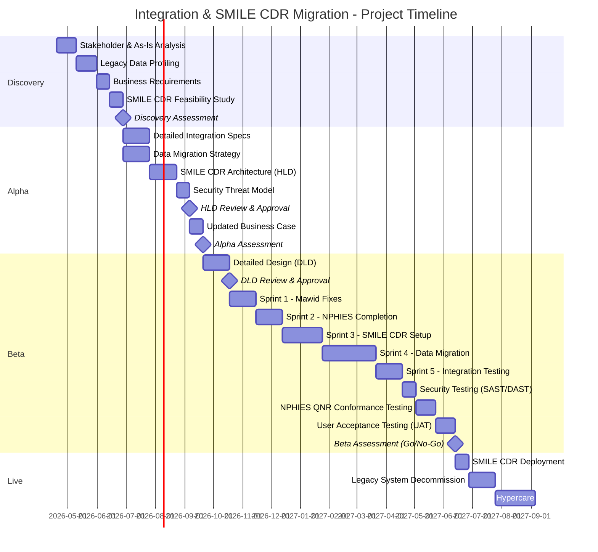
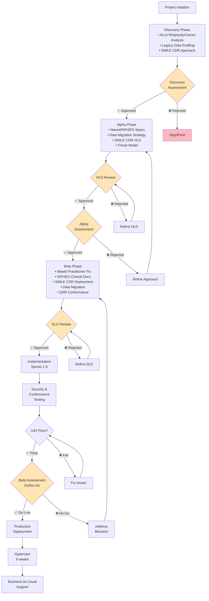

# Project Plan: Integration Strategy & SMILE CDR Migration

> **Template Origin**: Official | **ArcKit Version**: 1.0.0 | **Command**: `$arckit-plan`

## Document Control

| Field | Value |
|-------|-------|
| **Document ID** | ARC-001-PLAN-v1.1 |
| **Document Type** | Project Plan |
| **Project** | Integration Strategy & SMILE CDR Migration (Project 001) |
| **Classification** | OFFICIAL |
| **Status** | DRAFT |
| **Version** | 1.1 |
| **Created Date** | 2026-04-19 |
| **Last Modified** | 2026-04-19 |
| **Review Cycle** | Quarterly |
| **Next Review Date** | 2026-05-19 |
| **Owner** | Project Manager |
| **Reviewed By** | [PENDING] |
| **Approved By** | [PENDING] |
| **Distribution** | Project Team, Architecture Team, PSMMC Stakeholders |

## Revision History

| Version | Date | Author | Changes | Approved By | Approval Date |
|---------|------|--------|---------|-------------|---------------|
| 1.0 | 2026-04-19 | ArcKit AI | Initial creation from `$arckit-plan` command | PENDING | PENDING |
| 1.1 | 2026-04-19 | ArcKit AI | Updated with PSMMC integration context, Cerner/Mawid/NPHIES specs, and SMILE CDR migration | PENDING | PENDING |

---

## Executive Summary

**Project**: Integration Strategy & SMILE CDR Migration
**Duration**: 14-20 months (Large Complexity)
**Budget**: £[PENDING]
**Team**: [PENDING] FTE average
**Delivery Model**: Hybrid (Agile delivery within waterfall governance gates)

**Objective**: Complete the Mawid and NPHIES integrations via Rhapsody/Cerner, resolve outstanding interface issues, establish the SMILE CDR foundation, and execute data migration from Legacy HIS/EMR to SMILE CDR.

**Success Criteria**:

- Mawid Practitioner integration fixed and full Mawid use case suite operational [PP-C3]
- NPHIES WIP use cases (Clinical Docs, CDA, Rad Image Manifest) completed [PP-C2]
- SMILE CDR conformance and NPHIES QNR achieved [PP-C1]
- Successful data migration from Legacy HIS/EMR to SMILE CDR without data loss [PP-C4]
- Rhapsody integration pathways optimized for FHIR R4 KSA [PP-C3]

**Key Milestones**:

- Discovery Complete: Week 10
- Alpha Complete (HLD & SMILE CDR Approach approved): Week 24
- Beta Complete (Integrations Live & Migration verified): Week 60
- Production Launch: Week 61

---

## Timeline Overview (Gantt Chart)

---

## Workflow & Gates Diagram

---

## Discovery Phase (Weeks 1-10)

**Objective**: Validate problem, document As-Is Rhapsody/Cerner flows, and profile Legacy data for SMILE CDR.

### Activities & Timeline

| Week | Activity | ArcKit Command | Deliverable |
|------|----------|----------------|-------------|
| 1-3 | Stakeholder & As-Is Analysis | `$arckit-stakeholders` | Stakeholder map, Cerner/Rhapsody flow diagrams |
| 4-6 | Legacy Data Profiling | Manual | Data quality report, mapping prerequisites |
| 7-8 | Business Requirements | `$arckit-requirements` | Mawid/NPHIES BRs, Migration targets |
| 9-10 | SMILE CDR Feasibility Study | `$arckit-research` | Setup requirements, infrastructure needs |
| 10 | Initial Risk Register | `$arckit-risk` | Top 10 risks |

### Gate: Discovery Assessment (Week 10)

**Approval Criteria**:
- [ ] Mawid Practitioner issue identified
- [ ] NPHIES missing flows mapped
- [ ] Legacy HIS data volume and structure profiled
- [ ] SMILE CDR approach validated
- [ ] Stakeholder buy-in confirmed (Ayman, Asma, PSMMC, Lean)

**Approvers**: SRO, Architecture Board

---

## Alpha Phase (Weeks 11-24)

**Objective**: Design the target architecture for SMILE CDR and detail the integration fixes.

### Activities & Timeline

| Week | Activity | ArcKit Command | Deliverable |
|------|----------|----------------|-------------|
| 11-14 | Detailed Integration Specs | `$arckit-requirements` | FHIR R4 KSA mappings, HL7 translation rules |
| 11-14 | Data Migration Strategy | `$arckit-data-model` | Migration pathways, ETL rules |
| 15-18 | Architecture Design (HLD) | `$arckit-diagram` | SMILE CDR HLD, Rhapsody DMZ updates |
| 19-20 | Security Threat Model | Manual | STRIDE analysis for external APIs |
| 21-22 | HLD Review | `$arckit-hld-review` | HLD approval |
| 23-24 | Updated Business Case | `$arckit-sobc` | Revised project costs and licensing |

### Gate: HLD Review (Week 22)

**Approval Criteria**:
- [ ] SMILE CDR deployment model approved
- [ ] Data migration strategy addresses all legacy data
- [ ] Rhapsody internal/external DMZ flows securely defined
- [ ] Security architecture defined for FHIR endpoints

**Approvers**: Architecture Board, Security Lead

### Gate: Alpha Assessment (Week 24)

**Approval Criteria**:
- [ ] HLD approved
- [ ] Business case updated
- [ ] Team and budget confirmed for Beta

**Approvers**: SRO, Architecture Board, Finance

---

## Beta Phase (Weeks 25-60)

**Objective**: Build integrations, deploy SMILE CDR, execute data migration, and achieve QNR conformance.

### Activities & Timeline

| Week | Activity | ArcKit Command | Deliverable |
|------|----------|----------------|-------------|
| 25-28 | Detailed Design (DLD) | Manual | DLD document (ETL scripts, FHIR profiles) |
| 29 | DLD Review | `$arckit-dld-review` | DLD approval |
| 30-33 | Sprint 1 - Mawid Fixes | Manual | Practitioner fetch fixed |
| 34-37 | Sprint 2 - NPHIES Completion | Manual | Clinical Docs, Rad Image Manifest live in dev |
| 38-43 | Sprint 3 - SMILE CDR Setup | Manual | Core platform operational |
| 44-51 | Sprint 4 - Data Migration | Manual | Legacy data imported to SMILE CDR |
| 52-55 | Sprint 5 - Integration Testing | Manual | End-to-end flow validation |
| 56-57 | Security Testing (SAST/DAST) | Manual | Penetration test results |
| 58-60 | NPHIES QNR Conformance | Manual | Conformance certification |
| 58-60 | UAT & Operational Readiness | `$arckit-operationalize` | User sign-off, Runbooks |

### Gate: DLD Review (Week 29)

**Approval Criteria**:
- [ ] FHIR R4 KSA profiles fully documented
- [ ] Data migration ETL scripts defined
- [ ] NPHIES/Mawid endpoints specified

**Approvers**: Technical Lead, Architecture Board

### Gate: Beta Assessment / Go-Live (Week 60)

**Approval Criteria**:
- [ ] Mawid Practitioner fetching operational
- [ ] NPHIES QNR Conformance achieved
- [ ] Data migration completed with 0% critical data loss
- [ ] Security testing passed
- [ ] UAT signed off by PSMMC
- [ ] Operational readiness confirmed

**Approvers**: SRO, Architecture Board, Security Lead, Operations Lead

---

## Live Phase (Week 61+)

**Objective**: Deploy to production, decommission legacy HIS, and stabilize.

### Activities & Timeline

| Week | Activity | ArcKit Command | Deliverable |
|------|----------|----------------|-------------|
| 61-62 | Production Deployment | Manual | SMILE CDR Live |
| 63-66 | Legacy Decommissioning | Manual | Old HIS shut down |
| 67-72 | Hypercare | Manual | Issue resolution |

---

## External References

> This section provides traceability from generated content back to source documents.

### Document Register

| Doc ID | Filename | Type | Source Location | Description |
|--------|----------|------|-----------------|-------------|
| EXT-01 | NPHIES_QNR | Note | `external/NPHIES_QNR` | Notes on SMILE CDR and NPHIES QNR conformance |
| EXT-02 | cerner | Note | `external/cerner` | Cerner 2018.01.07, Rhapsody integration status, NPHIES WIP |
| EXT-03 | initial_discussion | Note | `external/initial_discussion` | High-level project focus and PSMMC contacts |
| EXT-04 | mawid_integration | Note | `external/mawid_integration` | Mawid FHIR R4 KSA use cases, Practitioner issue |

### Citations

| Citation ID | Doc ID | Category | Quoted Passage |
|-------------|--------|----------|----------------|
| [PP-C1] | EXT-01 | Requirement | "When we have smile CDR active... create a conformance" |
| [PP-C2] | EXT-02 | Scope | "Clinical Documents -- WIP... Rad Image Manifest -- ??" |
| [PP-C3] | EXT-04 | Issue | "Practitioners - Fetch doctor -- not working" |
| [PP-C4] | EXT-03 | Scope | "Data Migration from Legacy HIS/EMR to SMILE CDR" |

---

**Generated by**: ArcKit `$arckit-plan` command
**Generated on**: 2026-04-19 14:02 GMT
**ArcKit Version**: 1.0.0
**Project**: Integration Strategy & SMILE CDR Migration (Project 001)
**AI Model**: Gemini 3.1 Pro (High)
**Generation Context**: Updated based on Mawid, Cerner, NPHIES, and SMILE CDR context files
