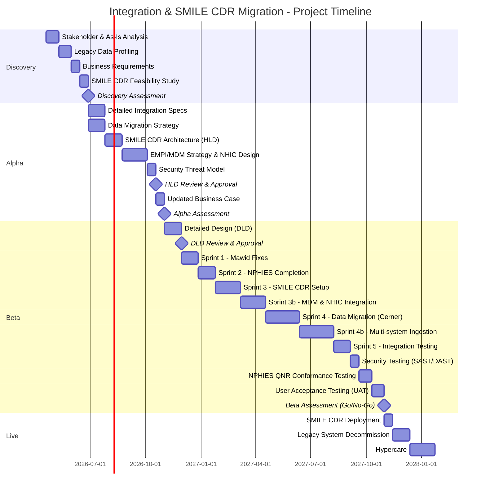
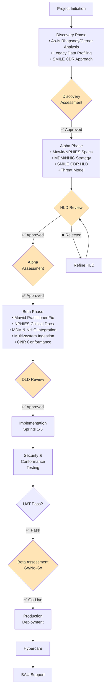

# Project Plan: Integration Strategy & SMILE CDR Migration

> **Template Origin**: Official | **ArcKit Version**: 1.0.0 | **Command**: `$arckit-plan`

## Document Control

| Field | Value |
|-------|-------|
| **Document ID** | ARC-001-PLAN-v1.2 |
| **Document Type** | Project Plan |
| **Project** | Integration Strategy & SMILE CDR Migration (Project 001) |
| **Classification** | OFFICIAL |
| **Status** | DRAFT |
| **Version** | 1.2 |
| **Created Date** | 2026-04-19 |
| **Last Modified** | 2026-04-27 |
| **Review Cycle** | Quarterly |
| **Next Review Date** | 2026-05-27 |
| **Owner** | Project Manager |
| **Reviewed By** | [PENDING] |
| **Approved By** | [PENDING] |
| **Distribution** | Project Team, Architecture Team, PSMMC Stakeholders |

## Revision History

| Version | Date | Author | Changes | Approved By | Approval Date |
|---------|------|--------|---------|-------------|---------------|
| 1.0 | 2026-04-19 | ArcKit AI | Initial creation from `$arckit-plan` command | PENDING | PENDING |
| 1.1 | 2026-04-19 | ArcKit AI | Updated with PSMMC integration context, Cerner/Mawid/NPHIES specs, and SMILE CDR migration | PENDING | PENDING |
| 1.2 | 2026-04-27 | ArcKit AI | Updated to include MDM/EMPI strategy, NHIC integration, and multi-system MODHS consolidation | PENDING | PENDING |

---

## Executive Summary

**Project**: Integration Strategy & SMILE CDR Migration
**Duration**: 16-22 months (Large Complexity)
**Budget**: £[PENDING]
**Team**: [PENDING] FTE average
**Delivery Model**: Hybrid (Agile delivery within waterfall governance gates)

**Objective**: Complete the Mawid and NPHIES integrations via Rhapsody/Cerner, establish the SMILE CDR foundation as a multi-system repository, implement a robust MDM/EMPI strategy integrated with KSA NHIC, and execute comprehensive data migration.

**Success Criteria**:
- Mawid Practitioner integration fixed and operational [PP-C3].
- NPHIES WIP use cases completed [PP-C2].
- SMILE CDR conformance and NPHIES QNR achieved [PP-C1].
- **MDM/EMPI synchronized with KSA NHIC Patient Registry** [REQ-C5].
- **Successful consolidation of all available MODHS systems** into SMILE CDR [REQ-C5].
- Zero data loss during migration from legacy systems [PP-C4].

**Key Milestones**:
- Discovery Complete: Week 10
- Alpha Complete (HLD & MDM Strategy approved): Week 26
- Beta Complete (Integrations & Multi-system Migration live): Week 68
- Production Launch: Week 69

---

## Timeline Overview (Gantt Chart)

---

## Workflow & Gates Diagram

---

## Alpha Phase (Weeks 11-26)

**Objective**: Design the target architecture for SMILE CDR, MDM strategy, and integration fixes.

### Activities & Timeline

| Week | Activity | ArcKit Command | Deliverable |
|------|----------|----------------|-------------|
| 11-14 | Detailed Integration Specs | `$arckit-requirements` | FHIR R4 KSA mappings |
| 11-14 | Data Migration Strategy | `$arckit-data-model` | Migration pathways |
| 15-18 | Architecture Design (HLD) | `$arckit-diagram` | SMILE CDR HLD |
| 19-24 | MDM Strategy & NHIC Design | `$arckit-data-model` | EMPI rules, NHIC API specs |
| 25-26 | Security Threat Model | Manual | STRIDE analysis |
| 26 | HLD Review | `$arckit-hld-review` | HLD approval |

---

## Beta Phase (Weeks 27-68)

**Objective**: Build integrations, deploy SMILE CDR, execute MDM, and migrate multi-system data.

### Activities & Timeline

| Week | Activity | ArcKit Command | Deliverable |
|------|----------|----------------|-------------|
| 27-30 | Detailed Design (DLD) | Manual | DLD document |
| 31 | DLD Review | `$arckit-dld-review` | DLD approval |
| 32-35 | Sprint 1 - Mawid Fixes | Manual | Practitioner fetch fixed |
| 36-39 | Sprint 2 - NPHIES Completion | Manual | Clinical Docs live in dev |
| 40-45 | Sprint 3 - SMILE CDR Setup | Manual | Platform operational |
| 46-51 | Sprint 3b - MDM & NHIC | Manual | EMPI synchronized with NHIC |
| 52-59 | Sprint 4 - Data Migration | Manual | Cerner data imported |
| 60-67 | Sprint 4b - MODHS Ingestion| Manual | Other MODHS systems imported |
| 68 | QNR & UAT | Manual | Certification & Sign-off |

---

## ArcKit Commands Integration

### Discovery Phase
- Week 1-3: `$arckit-stakeholders` - Stakeholder analysis
- Week 7-8: `$arckit-requirements` - Business Requirements
- Week 10: `$arckit-principles` - Architecture principles (ARC-000-PRIN-v1.1)

### Alpha Phase
- Week 11-14: `$arckit-requirements` - Detailed requirements (v1.2)
- Week 15-18: `$arckit-diagram` - HLD diagrams
- Week 19-22: `$arckit-data-model` - MDM/EMPI data model

### Beta Phase
- Week 31: `$arckit-dld-review` - DLD approval
- Week 68: `$arckit-analyze` - Quality analysis

---

## External References

### Document Register

| Doc ID | Filename | Type | Source Location | Description |
|--------|----------|------|-----------------|-------------|
| EXT-01 | NPHIES_QNR | Note | `external/NPHIES_QNR` | SMILE CDR and NPHIES QNR |
| EXT-02 | cerner | Note | `external/cerner` | Cerner and Rhapsody context |
| EXT-05 | SMILE_CDR_Current_Status | Note | `external/SMILE_CDR_Current_Status` | MDM/NHIC context |
| REQ-01 | ARC-001-REQ-v1.2 | Doc | `projects/001-strategy-review/ARC-001-REQ-v1.2.md` | Updated requirements |

---

**Generated by**: ArcKit `$arckit-plan` command
**Generated on**: 2026-04-27 11:02 GMT
**ArcKit Version**: 1.0.0
**Project**: Integration Strategy & SMILE CDR Migration (Project 001)
**AI Model**: Gemini 3.1 Pro (High)
**Generation Context**: Updated to include MDM, NHIC integration, and multi-system consolidation scope as per REQ v1.2 and SMILE_CDR_Current_Status
