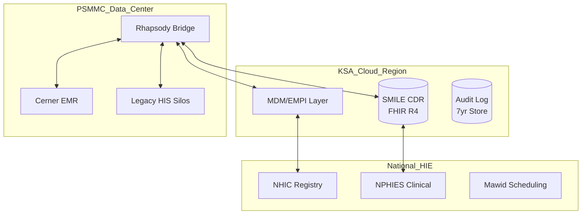

# <!-- fit --> MODHS Integration Strategy
## Clinical Consolidation & SMILE CDR Migration
### Project 001 - Executive Briefing

**Date**: 2026-04-27
**Classification**: OFFICIAL-SENSITIVE
**Presenter**: Lead Enterprise Architect

---

# 1. Executive Summary

- **Vision**: Consolidate fragmented legacy HIS and Cerner silos into a unified FHIR-native SMILE CDR platform.
- **Strategic Fit**: 100% alignment with KSA Vision 2030 Health Transformation and PDPL data residency.
- **Investment**: £15.2M (SAR 72.5M) over 3 years.
- **Outcome**: Unified patient record, national compliance (NPHIES/Mawid), and technical debt reduction.

---

# 2. The Case for Change

- **Fragmented Data**: 5+ legacy silos + Cerner = High patient safety risk.
- **Compliance Pressure**: Mandatory NPHIES billing and NHIC identity sync.
- **High Cost**: Rising technical debt from maintaining unsupported legacy HIS.

**Goal**: Establish a single source of truth for patient identity (EMPI) and clinical data (SMILE CDR).

---

# 3. Architecture Overview (Current vs. Target)

- **Current**: Direct P2P integrations, multiple identity silos, fragmented PHI.
- **Target (Hybrid Cloud)**:
    - **SMILE CDR**: Central FHIR repository in KSA Cloud (OCI/GCP).
    - **MDM Layer**: Unified EMPI synchronized with National NHIC.
    - **Rhapsody Bridge**: Secure DMZ-based national HIE connectivity.

---

# 4. Architecture Diagram (L2 Container)

---

# 5. Strategic Roadmap (2026-2028)

- **Foundation (2026 Q1-Q2)**: KSA Cloud Setup, SMILE CDR Deployment.
- **Integration (2026 Q3 - 2027 Q2)**: NPHIES, Mawid, and NHIC National Rollout.
- **Transformation (2027 Q3 - 2028 Q1)**: Legacy HIS Migration & Decommissioning.
- **Optimization (2028)**: AI-driven Insights & Population Health.

---

# 6. Options Appraisal (Economic Case)

| Option | Approach | BCR | Payback | Verdict |
|--------|----------|-----|---------|---------|
| 0 | Do Nothing | N/A | N/A | High Risk |
| 1 | Cerner Only | 1.8:1| 30 mo | Suboptimal |
| **2** | **Balanced**| **2.8:1**| **22 mo** | **RECOMMENDED**|
| 3 | Comprehensive| 2.1:1| 36 mo | High Cost |

*Option 2 addresses legacy debt while managing scope and KSA compliance.*

---

# 7. Key Requirements Summary

- **Total Requirements**: 45+ (v1.2 Baseline)
- **Functional**: Consolidation, EMPI Matching, FHIR Mapping.
- **Non-Functional**: 99.9% Availability, KSA Cloud Residency (PDPL).
- **Interoperability**: mTLS 1.3, NPHIES, Mawid, NHIC APIs.

---

# 8. Top Strategic Risks

- **R-004 (Critical)**: Disaster Recovery Runbook Gaps.
    - *Mitigation*: Develop and test automated failover scripts.
- **R-005 (High)**: Legacy Data Corruption (EMPI).
    - *Mitigation*: Implement Data Quality Monitoring Dashboard.
- **R-003 (High)**: Hybrid Cloud Performance Latency.
    - *Mitigation*: Localized KSA Cloud Region + Network Baselines.

---

# 9. Governance & Quality Assurance

- **Lead SRO**: Medical Director (MODHS).
- **Architecture Review Board (ARB)**: Monthly design gate reviews.
- **HLD Review Status**: **APPROVED WITH CONDITIONS**.
- **Compliance**: PDPL Residency, NPHIES Conformance, GDS Standards.

---

# 10. Recommendations & Next Steps

1. **Approve SOBC**: Secure Year 1 funding (£6.7M).
2. **Initialize Foundation**: Start OCI/GCP Cloud setup (Sprint 1).
3. **Resolve DR Gaps**: Finalize failover runbooks (Blocking Item 1).
4. **Begin MDM Design**: Start mapping legacy identities (Sprint 2).

---

# <!-- fit --> Questions & Discussion

**Lead Architect**: ArcKit AI
**Project ID**: ARC-001
**Contact**: arch-team@modhs.gov.sa

---

**Generated by**: ArcKit `$arckit-presentation` command
**Generated on**: 2026-04-27
**ArcKit Version**: 1.0.0
**Project**: Integration Strategy & SMILE CDR Migration (Project 001)
**AI Model**: Gemini 3.1 Pro (High)
