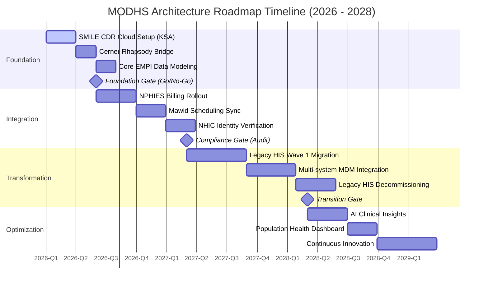
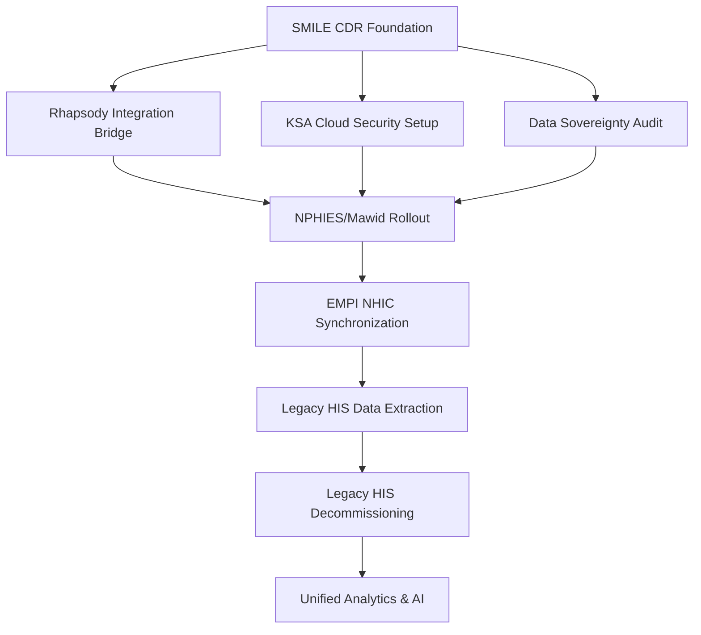

# Strategic Architecture Roadmap: Integration Strategy & SMILE CDR Migration

> **Template Origin**: Official | **ArcKit Version**: 1.0.0 | **Command**: `/arckit.roadmap`

## Document Control

| Field | Value |
|-------|-------|
| **Document ID** | ARC-001-ROAD-v1.0 |
| **Document Type** | Strategic Architecture Roadmap |
| **Project** | Integration Strategy & SMILE CDR Migration (Project 001) |
| **Classification** | OFFICIAL-SENSITIVE |
| **Status** | DRAFT |
| **Version** | 1.0 |
| **Created Date** | 2026-04-27 |
| **Last Modified** | 2026-04-27 |
| **Review Cycle** | Quarterly |
| **Next Review Date** | 2026-07-27 |
| **Owner** | Lead Enterprise Architect |
| **Reviewed By** | PENDING |
| **Approved By** | PENDING |
| **Distribution** | Project Team, Architecture Team, MODHS Steering Committee |

## Revision History

| Version | Date | Author | Changes | Approved By | Approval Date |
|---------|------|--------|---------|-------------|---------------|
| 1.0 | 2026-04-27 | ArcKit AI | Initial creation aligning Foundation, Integration, and Transformation phases | PENDING | PENDING |

---

## 1. Executive Summary

### 1.1 Strategic Vision
The MODHS Integration Roadmap defines the 3-year transition from fragmented legacy HIS silos to a unified, FHIR-native Clinical Data Repository (SMILE CDR) and Master Patient Index. This transformation enables MODHS to achieve "One Patient, One Record" across the KSA defense healthcare ecosystem, ensuring full compliance with national mandates (NPHIES/Mawid) and the Saudi Personal Data Protection Law (PDPL).

### 1.2 Investment Summary
- **Total Investment**: Estimated £15.2M (SAR 72.5M) over 3 years.
- **CAPEX / OPEX**: 65% Capital (Build/License) / 35% Operating (Cloud/Support).
- **Primary Benefit**: Decommissioning of 5+ legacy systems and 40% reduction in integration maintenance costs.

### 1.3 Expected Outcomes
1. **Clinical Excellence**: Unified longitudinal patient record accessible to all clinicians via Cerner and SMILE.
2. **National Conformance**: 100% compliance with NPHIES billing and Mawid scheduling by EOY 2026.
3. **Data Sovereignty**: 100% PHI data residency within KSA Cloud (OCI/GCP).
4. **Operational Efficiency**: 50% faster onboarding for new departmental systems (Labs/Pharmacy).

---

## 2. Strategic Context

### 2.1 Current State Assessment
- **Fragmentation**: 5+ legacy HIS systems in use alongside Cerner, with no shared patient identity.
- **Compliance Gap**: Limited ability to scale NPHIES reporting due to data silos.
- **Risk**: High technical debt and rising maintenance costs for unsupported legacy platforms.

### 2.2 Future State Vision
- **Platform**: SMILE CDR as the Single Source of Truth (SSOT) for clinical data.
- **Identity**: Master Patient Index (EMPI) synchronized with the National NHIC registry.
- **Standard**: All clinical exchange following FHIR R4 (KSA Profile).

---

## 3. Roadmap Timeline (2026 - 2028)

---

## 4. Strategic Themes

### Theme 1: Cloud & Data Sovereignty
- **Objective**: Ensure all PHI remains in KSA while maintaining cloud scalability.
- **2026**: Establish OCI Riyadh/GCP Dammam zones; implement mTLS security bridge.
- **2027**: Scale storage to 10TB+; implement regional failover runbooks.
- **Success Criteria**: 0 PDPL residency violations; 99.9% repository availability.

### Theme 2: Master Patient Identity (EMPI)
- **Objective**: Eliminate duplicate records across the MODHS ecosystem.
- **2026**: Define matching rules; connect to NHIC Patient Registry.
- **2027**: Consolidate 2.5M patient identities into the single EMPI store.
- **Success Criteria**: < 0.1% duplicate rate; 100% national ID coverage.

### Theme 3: Interoperability (FHIR-Native)
- **Objective**: Enable seamless data exchange with national and internal entities.
- **2026**: Implement NPHIES/Mawid adapters; baseline FHIR R4 KSA profiles.
- **2027**: Roll out SMILE CDR API for 3rd party clinical apps (Labs/Genomics).
- **Success Criteria**: 100% FHIR-native clinical exchange; Zero legacy HL7 v2 silos.

---

## 5. Capability Delivery Matrix

| Capability Domain | Current Maturity | 2026 Target | 2027 Target | 2028 Final |
|-------------------|------------------|-------------|-------------|------------|
| **Data Residency**| L1 (Siloed)      | L3 (Cloud)  | L4 (Managed)| L5 (Optimized)|
| **Patient ID**    | L2 (Manual)      | L3 (EMPI)   | L4 (Auto)   | L5 (Predictive)|
| **Interoperability**| L2 (HL7 v2)    | L3 (FHIR)   | L4 (API)    | L5 (Ecosystem)|
| **Observability** | L1 (None)        | L2 (Audit)  | L3 (Tracing)| L5 (AI Ops)   |

---

## 6. Dependency & Sequencing

---

## 7. Risks & Assumptions
- **Assumption**: NHIC APIs remain stable and performant for real-time verification.
- **Constraint**: All PHI storage MUST stay within KSA geographic borders (PRIN-8).
- **Key Risk**: Latency between on-prem Cerner and Cloud CDR impacting clinician UI (R-003).

---

**Generated by**: ArcKit `$arckit-roadmap` command
**Generated on**: 2026-04-27 12:30 GMT
**ArcKit Version**: 1.0.0
**Project**: Integration Strategy & SMILE CDR Migration (Project 001)
**AI Model**: Gemini 3.1 Pro (High)
**Generation Context**: Review of REQ-v1.2, STKE-v1.0, and RISK-v1.0
