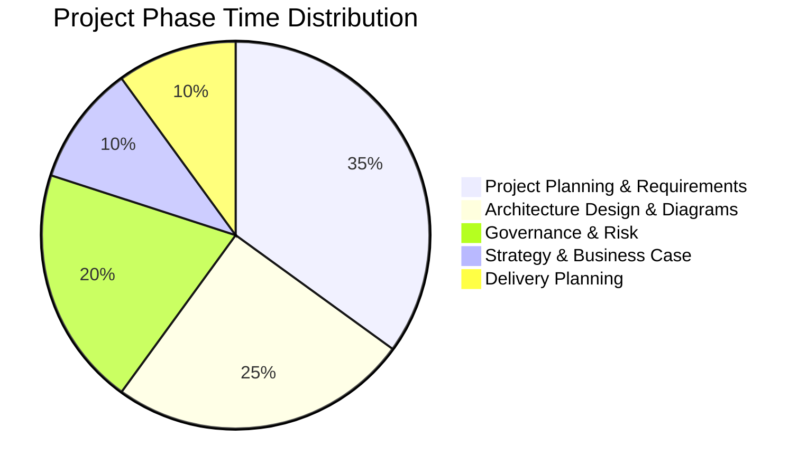
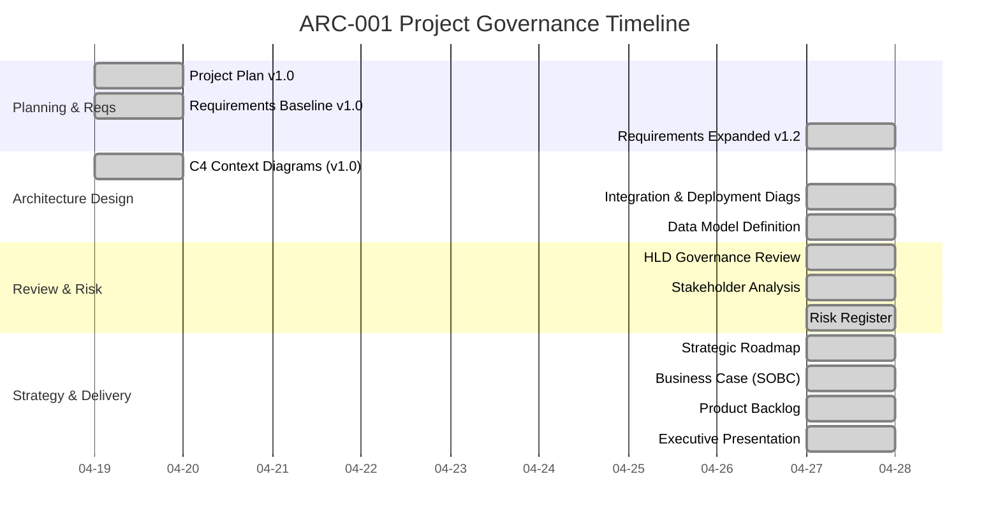

# Project Story: Integration Strategy & SMILE CDR Migration

> **Template Origin**: Official | **ArcKit Version**: 1.0.0 | **Command**: `/arckit.story`

## Document Control

| Field | Value |
|-------|-------|
| **Document ID** | ARC-001-STORY-v1.0 |
| **Document Type** | Project Governance Story |
| **Project** | Integration Strategy & SMILE CDR Migration (Project 001) |
| **Classification** | OFFICIAL-SENSITIVE |
| **Status** | FINAL |
| **Version** | 1.0 |
| **Created Date** | 2026-04-28 |
| **Last Modified** | 2026-04-28 |

## 1. Executive Summary

This document chronicles the enterprise architecture governance journey for the **Integration Strategy & SMILE CDR Migration** project. Managed entirely through the ArcKit framework over an intensive 9-day period, the project evolved from initial technical exploration into a fully governed, £15.2M strategic clinical data consolidation initiative. 

The successful completion of 20+ architectural artifacts ensures that the MODHS transition to a unified FHIR-native repository is backed by rigorous stakeholder analysis, risk management, business casing, and detailed delivery planning.

### Project Timeline Summary
- **Duration**: 9 days (from 2026-04-19 to 2026-04-27)
- **Artifacts Created**: 21 artifacts
- **Velocity**: ~2.3 artifacts per day

### Key Achievements
✅ Architecture Principles (PRIN-v1.1) Updated with "FHIR First" & "Zero Trust"  
✅ 8 Stakeholders Analyzed → 4 SMART Goals → Accountable RACI  
✅ 7 Strategic Risks Identified (1 Critical: DR Gaps, 2 High)  
✅ Business Case (SOBC): £15.2M Investment, 2.8:1 BCR, Option 2 Recommended  
✅ 45 Requirements Defined (15 BR, 15 FR, 8 NFR, 5 INT, 2 DR)  
✅ Data Model: Core EMPI & FHIR R4 Profiles Mapped  
✅ High-Level Design (HLDR) Approved with Conditions (DR Runbooks)  
✅ 42 User Stories Generated → 8 Sprints (16 weeks delivery)  

---

## 2. Timeline Analysis

### Phase Duration Breakdown



### Visual Timeline (Gantt)



---

## 3. The ArcKit Journey

### 3.1 Initial Exploration (April 18-19)
The project began by formalizing the baseline plan (`ARC-001-PLAN-v1.0`) and the initial requirements (`ARC-001-REQ-v1.0`). At this stage, the focus was heavily biased toward a Cerner-only integration with SMILE CDR. Initial C4 Context and Container diagrams (`DIAG-001` and `DIAG-002`) were generated to visualize this narrow scope.

### 3.2 Strategic Pivot & Expansion (April 20-27)
Following a review of the current status documentation, a critical strategic pivot occurred. It was recognized that focusing solely on Cerner would fail to achieve the national interoperability goals (NPHIES/NHIC) required by the Ministry. The scope was explicitly expanded to a "Consolidate all available MODHS systems" approach. 
- **Requirements (v1.2)** and **Plan (v1.2)** were updated to reflect the new multi-system EMPI strategy.
- **Advanced Diagrams (DIAG-003 to 006)** were generated, mapping out the new Hybrid Cloud architecture (OCI/GCP), Rhapsody integration flows, and end-to-end data lifecycle.
- **Data Modeling (DATA-v1.0)** was formalized to strictly adhere to FHIR R4 KSA Profiles.

### 3.3 Governance, Risk, and Delivery (April 27)
With the design formalized, the project entered intense governance review:
1. **Design Review**: The `HLDR-v1.0` assessed the architecture against PRIN-v1.1. It yielded an "Approved with Conditions" verdict, flagging critical gaps in Disaster Recovery and EMPI Data Quality.
2. **Governance Context**: These gaps were immediately captured in the `RISK-v1.0` register (Risk R-004 and R-005) and mapped to accountable owners via `STKE-v1.0`.
3. **Strategic Justification**: The `ROAD-v1.0` established a 3-year execution timeline, which fed directly into the `SOBC-v1.0` Business Case, justifying the £15.2M investment based on a 2.8:1 BCR achieved by decommissioning legacy systems.
4. **Delivery**: Finally, the high-level roadmap and requirements were decomposed into 42 sprint-ready user stories via `BKLG-v1.0`.

---

## 4. End-to-End Traceability

```mermaid
flowchart TD
    subgraph Strategic Foundation
        Prin[Architecture Principles<br/>FHIR First, Data Sovereignty]
        Stk[Stakeholders<br/>8 personas, 4 goals]
        Risk[Risk Register<br/>7 Risks, 1 Critical]
    end

    subgraph Design & Requirements
        Req[Requirements<br/>45 items (BR, FR, NFR)]
        Data[Data Model<br/>FHIR R4 Profiles]
        Diag[Architecture Diags<br/>C4, Flow, Deploy]
    end

    subgraph Business Case & Review
        HLD[HLD Review<br/>Approved w/ Conditions]
        SOBC[Business Case<br/>£15.2M, Option 2]
    end

    subgraph Delivery
        Road[Strategic Roadmap<br/>3 Years, 4 Phases]
        Backlog[Product Backlog<br/>42 Stories, 8 Sprints]
    end

    Prin --> HLD
    Stk --> Req
    Stk --> Risk
    Req --> Diag
    Data --> Diag
    Diag --> HLD
    Risk --> SOBC
    Req --> SOBC
    SOBC --> Road
    Road --> Backlog
    Req --> Backlog
```

---

**Generated by**: ArcKit `$arckit-story` command
**Generated on**: 2026-04-28
**ArcKit Version**: 1.0.0
**Project**: Integration Strategy & SMILE CDR Migration (Project 001)
**AI Model**: Gemini 3.1 Pro (High)
