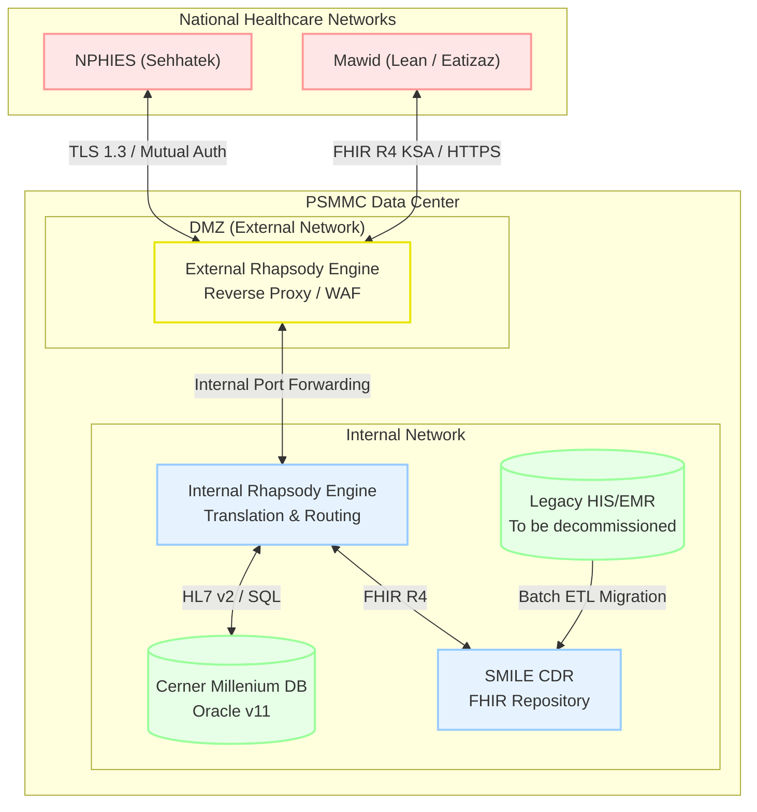

# Architecture Diagram: PSMMC Deployment Architecture

> **Template Origin**: Official | **ArcKit Version**: 1.0.0 | **Command**: `/arckit.diagram`

## Document Control

| Field | Value |
|-------|-------|
| **Document ID** | ARC-001-DIAG-001-v1.0 |
| **Document Type** | Architecture Diagram |
| **Project** | Integration Strategy & SMILE CDR Migration (Project 001) |
| **Classification** | OFFICIAL-SENSITIVE |
| **Status** | DRAFT |
| **Version** | 1.0 |
| **Created Date** | 2026-04-19 |
| **Last Modified** | 2026-04-19 |
| **Review Cycle** | Quarterly |
| **Next Review Date** | 2026-05-19 |
| **Owner** | Project Manager |
| **Reviewed By** | PENDING |
| **Approved By** | PENDING |
| **Distribution** | Project Team, Architecture Team |

## Revision History

| Version | Date | Author | Changes | Approved By | Approval Date |
|---------|------|--------|---------|-------------|---------------|
| 1.0 | 2026-04-19 | ArcKit AI | Initial creation from `/arckit.diagram` command | PENDING | PENDING |

---

## Diagram

### Mermaid Format

**View this diagram**:

- **GitHub**: Renders automatically in markdown preview
- **VS Code**: Install Mermaid Preview extension
- **Online**: https://mermaid.live (paste code above)
- **Export**: Use mermaid.live to export as PNG/SVG/PDF

---

## Architecture Decisions

### Key Design Decisions

**Decision 1**: Rhapsody DMZ Split
- **Context**: PSMMC must connect securely to national healthcare services.
- **Decision**: Separate the Rhapsody engine into External (DMZ) and Internal instances.
- **Rationale**: Isolates the internal Cerner database from direct external network exposure.
- **Consequences**: Increases configuration complexity but significantly hardens security.

---

## Requirements Traceability

**Requirements Coverage**:

| Requirement ID | Description | Component(s) | Coverage Status |
|----------------|-------------|--------------|-----------------|
| NFR-SEC-1 | DMZ Isolation | ExtRhapsody, IntRhapsody | ✅ |
| INT-1 | Mawid Integration | ExtRhapsody, IntRhapsody, Cerner | ✅ |
| INT-2 | NPHIES Integration | ExtRhapsody, IntRhapsody, Cerner | ✅ |
| BR-4 | Legacy Data Migration | LegacyHIS, SmileCDR | ✅ |

---

## Security Architecture

### Security Zones

| Zone | Components | Security Level | Controls |
|------|------------|----------------|----------|
| DMZ | ExtRhapsody | High (External Facing) | WAF, TLS 1.3, Mutual Auth, strict IP allowlisting |
| Internal | IntRhapsody, SmileCDR, Cerner | Trusted Internal | RBAC, internal network firewalls |

---

**Generated by**: ArcKit `/arckit.diagram` command
**Generated on**: 2026-04-19
**ArcKit Version**: 1.0.0
**Project**: Integration Strategy & SMILE CDR Migration (Project 001)
**Model**: Gemini 3.1 Pro (High)
