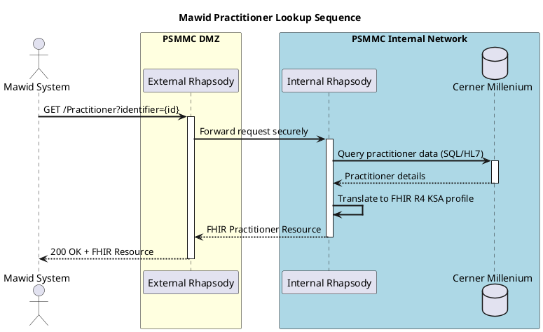

# Architecture Diagram: Mawid Practitioner Lookup Sequence

> **Template Origin**: Official | **ArcKit Version**: 1.0.0 | **Command**: `/arckit.diagram`

## Document Control

| Field | Value |
|-------|-------|
| **Document ID** | ARC-001-DIAG-002-v1.0 |
| **Document Type** | Architecture Diagram |
| **Project** | Integration Strategy & SMILE CDR Migration (Project 001) |
| **Classification** | OFFICIAL-SENSITIVE |
| **Status** | DRAFT |
| **Version** | 1.0 |
| **Created Date** | 2026-04-19 |
| **Last Modified** | 2026-04-19 |
| **Review Cycle** | Quarterly |
| **Next Review Date** | 2026-05-19 |
| **Owner** | Project Manager |
| **Reviewed By** | PENDING |
| **Approved By** | PENDING |
| **Distribution** | Project Team, Architecture Team |

## Revision History

| Version | Date | Author | Changes | Approved By | Approval Date |
|---------|------|--------|---------|-------------|---------------|
| 1.0 | 2026-04-19 | ArcKit AI | Initial creation from `/arckit.diagram` command | PENDING | PENDING |

---

## Diagram

### PlantUML Format

**View this diagram** (PlantUML does NOT render in GitHub markdown):

- **Online**: https://www.plantuml.com/plantuml/uml/ (paste code above)
- **VS Code**: Install PlantUML extension (jebbs.plantuml)
- **CLI**: `java -jar plantuml.jar diagram.puml`
- **Export**: Use PlantUML Server to export as PNG/SVG/PDF

---

## Requirements Traceability

**Requirements Coverage**:

| Requirement ID | Description | Component(s) | Coverage Status |
|----------------|-------------|--------------|-----------------|
| BR-1 | Complete Mawid Integration | ExtRhapsody, IntRhapsody, Cerner | ✅ |
| FR-1 | FHIR R4 KSA Translation | IntRhapsody | ✅ |

---

## Integration Points

### APIs and Endpoints

| API | Endpoint | Method | Purpose | Authentication |
|-----|----------|--------|---------|----------------|
| Mawid Practitioner API | `/Practitioner` | GET | Look up doctor details | Mutual TLS / API Key |

---

**Generated by**: ArcKit `/arckit.diagram` command
**Generated on**: 2026-04-19
**ArcKit Version**: 1.0.0
**Project**: Integration Strategy & SMILE CDR Migration (Project 001)
**Model**: Gemini 3.1 Pro (High)
