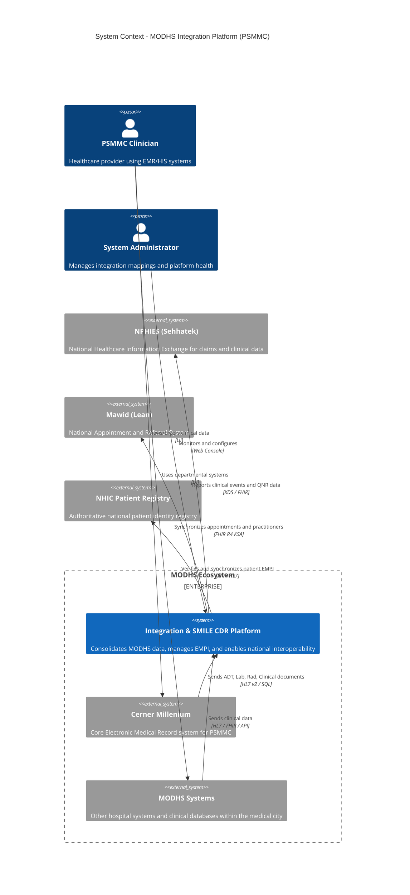

# Architecture Diagram: System Context

> **Template Origin**: Official | **ArcKit Version**: 1.0.0 | **Command**: `/arckit.diagram`

## Document Control

| Field | Value |
|-------|-------|
| **Document ID** | ARC-001-DIAG-003-v1.0 |
| **Document Type** | Architecture Diagram |
| **Project** | Integration Strategy & SMILE CDR Migration (Project 001) |
| **Classification** | OFFICIAL-SENSITIVE |
| **Status** | DRAFT |
| **Version** | 1.0 |
| **Created Date** | 2026-04-27 |
| **Last Modified** | 2026-04-27 |
| **Review Cycle** | Quarterly |
| **Next Review Date** | 2026-05-27 |
| **Owner** | Project Manager |
| **Reviewed By** | PENDING |
| **Approved By** | PENDING |
| **Distribution** | Project Team, Architecture Team |

## Revision History

| Version | Date | Author | Changes | Approved By | Approval Date |
|---------|------|--------|---------|-------------|---------------|
| 1.0 | 2026-04-27 | ArcKit AI | Initial Level 1 Context Diagram reflecting REQ v1.2 scope | PENDING | PENDING |

---

## Diagram

### Mermaid Format

**View this diagram**:

- **GitHub**: Renders automatically in markdown preview
- **VS Code**: Install Mermaid Preview extension
- **Online**: https://mermaid.live (paste code above)

---

## Component Inventory

| Component | Type | Technology | Responsibility | Evolution Stage | Build/Buy |
|-----------|------|------------|----------------|-----------------|-----------|
| Integration & SMILE CDR Platform | System | Rhapsody, SMILE CDR | Core data hub and FHIR repository | Custom (0.45) | HYBRID |
| Cerner Millenium | System_Ext | Oracle, Java | Primary EMR for PSMMC | Product (0.70) | BUY |
| MODHS Systems | System_Ext | Various | Departmental clinical systems | Product (0.65) | BUY |
| NPHIES | System_Ext | FHIR, XDS | National HIE | Commodity (0.85) | USE |
| Mawid | System_Ext | FHIR R4 KSA | National Appointment System | Commodity (0.80) | USE |
| NHIC Patient Registry | System_Ext | API | Authoritative identity source | Commodity (0.90) | USE |

---

## Architecture Decisions

### Key Design Decisions

**Decision 1**: Multi-system Consolidation
- **Context**: Previous scope was Cerner-centric, leading to data silos [REQ-C5].
- **Decision**: Architect the SMILE CDR platform to ingest data from all available MODHS systems.
- **Rationale**: Enables a true Enterprise Health Record and a consistent Single Source of Truth.
- **Consequences**: Requires robust MDM/EMPI logic to handle overlapping patient records.

**Decision 2**: NHIC Integration for EMPI
- **Context**: Patient identity must be consistent across national borders.
- **Decision**: Integrate the MDM layer directly with the KSA NHIC Patient Registry [REQ-C5].
- **Rationale**: Reduces duplication and ensures compliance with national standards.

---

## Requirements Traceability

**Requirements Coverage**:

| Requirement ID | Description | Component(s) | Coverage Status |
|----------------|-------------|--------------|-----------------|
| BR-5 | MODHS System Consolidation | integration_platform, modhs_systems | ✅ |
| BR-6 | MDM for Patient EMPI | integration_platform, nhic | ✅ |
| INT-3 | NHIC Patient Registry Integration | integration_platform, nhic | ✅ |

---

**Generated by**: ArcKit `/arckit.diagram` command
**Generated on**: 2026-04-27 11:05 GMT
**ArcKit Version**: 1.0.0
**Project**: Integration Strategy & SMILE CDR Migration (Project 001)
**AI Model**: Gemini 3.1 Pro (High)
**Generation Context**: Level 1 Context Diagram reflecting REQ v1.2 and SMILE_CDR_Current_Status
