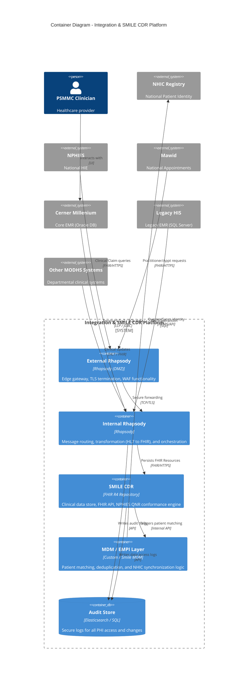

# Architecture Diagram: Container Diagram

> **Template Origin**: Official | **ArcKit Version**: 1.0.0 | **Command**: `/arckit.diagram`

## Document Control

| Field | Value |
|-------|-------|
| **Document ID** | ARC-001-DIAG-004-v1.0 |
| **Document Type** | Architecture Diagram |
| **Project** | Integration Strategy & SMILE CDR Migration (Project 001) |
| **Classification** | OFFICIAL-SENSITIVE |
| **Status** | DRAFT |
| **Version** | 1.0 |
| **Created Date** | 2026-04-27 |
| **Last Modified** | 2026-04-27 |
| **Review Cycle** | Quarterly |
| **Next Review Date** | 2026-05-27 |
| **Owner** | Project Manager |
| **Reviewed By** | PENDING |
| **Approved By** | PENDING |
| **Distribution** | Project Team, Architecture Team |

## Revision History

| Version | Date | Author | Changes | Approved By | Approval Date |
|---------|------|--------|---------|-------------|---------------|
| 1.0 | 2026-04-27 | ArcKit AI | Initial Level 2 Container Diagram showing internal platform structure and MDM layer | PENDING | PENDING |

---

## Diagram

### Mermaid Format

**View this diagram**:

- **GitHub**: Renders automatically in markdown preview
- **VS Code**: Install Mermaid Preview extension
- **Online**: https://mermaid.live (paste code above)

---

## Component Inventory

| Component | Type | Technology | Responsibility | Evolution Stage | Build/Buy |
|-----------|------|------------|----------------|-----------------|-----------|
| External Rhapsody | Container | Rhapsody (DMZ) | Edge security and TLS termination | Product (0.75) | BUY |
| Internal Rhapsody | Container | Rhapsody | Transformation and internal routing | Product (0.75) | BUY |
| SMILE CDR | Container | FHIR Repository | High-scale clinical data storage | Product (0.70) | BUY |
| MDM / EMPI Layer | Container | Custom / Smile | Patient cross-referencing and NHIC sync | Custom (0.40) | BUILD/HYBRID |
| Audit Store | ContainerDb | Elasticsearch | Secure immutable audit logging | Product (0.80) | USE |

---

## Architecture Decisions

### Key Design Decisions

**Decision 1**: Decoupled MDM Layer
- **Context**: Patient identity complexity across multiple MODHS systems [REQ-C5].
- **Decision**: Implement a dedicated MDM/EMPI layer that sits between the SMILE CDR and external registries.
- **Rationale**: Isolates complex matching logic from core data storage and allows for modular updates to NHIC integration.
- **Consequences**: Introduces an additional hop in the data ingestion pipeline, requiring low-latency matching.

---

## Requirements Traceability

**Requirements Coverage**:

| Requirement ID | Description | Component(s) | Coverage Status |
|----------------|-------------|--------------|-----------------|
| NFR-SEC-1 | Zero Trust Architecture | ext_rhap, int_rhap | ✅ |
| NFR-SEC-3 | Health Data Residency | smile_cdr, audit_log | ✅ |
| BR-6 | MDM for Patient EMPI | mdm_layer, nhic | ✅ |

---

**Generated by**: ArcKit `/arckit.diagram` command
**Generated on**: 2026-04-27 11:06 GMT
**ArcKit Version**: 1.0.0
**Project**: Integration Strategy & SMILE CDR Migration (Project 001)
**AI Model**: Gemini 3.1 Pro (High)
**Generation Context**: Level 2 Container Diagram reflecting REQ v1.2 and SMILE_CDR_Current_Status
