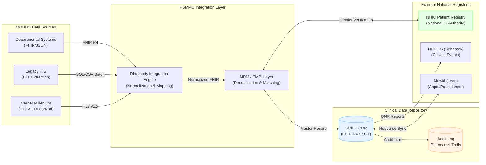

# Architecture Diagram: Data Flow Diagram

> **Template Origin**: Official | **ArcKit Version**: 1.0.0 | **Command**: `/arckit.diagram`

## Document Control

| Field | Value |
|-------|-------|
| **Document ID** | ARC-001-DIAG-005-v1.0 |
| **Document Type** | Architecture Diagram |
| **Project** | Integration Strategy & SMILE CDR Migration (Project 001) |
| **Classification** | OFFICIAL-SENSITIVE |
| **Status** | DRAFT |
| **Version** | 1.0 |
| **Created Date** | 2026-04-27 |
| **Last Modified** | 2026-04-27 |
| **Review Cycle** | Quarterly |
| **Next Review Date** | 2026-05-27 |
| **Owner** | Project Manager |
| **Reviewed By** | PENDING |
| **Approved By** | PENDING |
| **Distribution** | Project Team, Architecture Team |

## Revision History

| Version | Date | Author | Changes | Approved By | Approval Date |
|---------|------|--------|---------|-------------|---------------|
| 1.0 | 2026-04-27 | ArcKit AI | Initial Data Flow Diagram showing multi-system ingestion and NHIC synchronization | PENDING | PENDING |

---

## Diagram

### Mermaid Format

**View this diagram**:

- **GitHub**: Renders automatically in markdown preview
- **VS Code**: Install Mermaid Preview extension
- **Online**: https://mermaid.live (paste code above)

---

## Data Flow Details

### Data Sources

| Data Source | Type | Data Format | Update Frequency | Owner |
|-------------|------|-------------|------------------|-------|
| Cerner Millenium | EMR | HL7 v2.x | Real-time | PSMMC IT |
| Legacy HIS | Legacy EMR | SQL / CSV | One-time / Phased | PSMMC IT |
| Departmental Systems| Various | FHIR / JSON | Real-time | Dept Heads |

### Data Sinks

| Data Sink | Type | Data Format | Retention | Backup |
|-----------|------|-------------|-----------|--------|
| SMILE CDR | FHIR Repo | FHIR R4 JSON | Permanent | Daily / Incremental |
| Audit Log | Log Store | JSON / Encrypted | 7 Years (Saudi Law) | Immutable Storage |

### PII Handling (Saudi PDPL Compliance)

| Component | PII Type | Processing | Legal Basis | Retention | Deletion |
|-----------|----------|------------|-------------|-----------|----------|
| MDM Layer | Name, National ID, DOB | Matching & Verification | Healthcare Delivery | Permanent | Upon Request (NHIC) |
| SMILE CDR | Full Clinical Record | Storage & Exchange | Clinical Safety | Permanent | Per Retention Policy |

---

## Requirements Traceability

**Requirements Coverage**:

| Requirement ID | Description | Component(s) | Coverage Status |
|----------------|-------------|--------------|-----------------|
| BR-5 | MODHS System Consolidation | Rhapsody, SmileCDR | ✅ |
| BR-6 | MDM for Patient EMPI | MDM, NHIC | ✅ |
| NFR-SEC-2 | PDPL Compliance | MDM, SmileCDR, Audit | ✅ |

---

**Generated by**: ArcKit `/arckit.diagram` command
**Generated on**: 2026-04-27 11:07 GMT
**ArcKit Version**: 1.0.0
**Project**: Integration Strategy & SMILE CDR Migration (Project 001)
**AI Model**: Gemini 3.1 Pro (High)
**Generation Context**: Data Flow Diagram reflecting REQ v1.2 and SMILE_CDR_Current_Status
