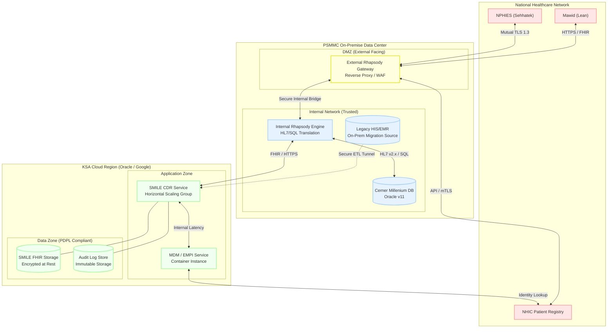

# Architecture Diagram: Deployment Diagram

> **Template Origin**: Official | **ArcKit Version**: 1.0.0 | **Command**: `/arckit.diagram`

## Document Control

| Field | Value |
|-------|-------|
| **Document ID** | ARC-001-DIAG-006-v1.0 |
| **Document Type** | Architecture Diagram |
| **Project** | Integration Strategy & SMILE CDR Migration (Project 001) |
| **Classification** | OFFICIAL-SENSITIVE |
| **Status** | DRAFT |
| **Version** | 1.0 |
| **Created Date** | 2026-04-27 |
| **Last Modified** | 2026-04-27 |
| **Review Cycle** | Quarterly |
| **Next Review Date** | 2026-05-27 |
| **Owner** | Project Manager |
| **Reviewed By** | PENDING |
| **Approved By** | PENDING |
| **Distribution** | Project Team, Architecture Team |

## Revision History

| Version | Date | Author | Changes | Approved By | Approval Date |
|---------|------|--------|---------|-------------|---------------|
| 1.0 | 2026-04-27 | ArcKit AI | Initial Level 4 Deployment Diagram showing Hybrid Cloud (PSMMC DC + KSA Cloud) | PENDING | PENDING |

---

## Diagram

### Mermaid Format

**View this diagram**:

- **GitHub**: Renders automatically in markdown preview
- **VS Code**: Install Mermaid Preview extension
- **Online**: https://mermaid.live (paste code above)

---

## Deployment Architecture

### Cloud Provider

**Provider**: Oracle Cloud (OCI) or Google Cloud (GCP)
**Region**: KSA (Riyadh / Dammam)
**Availability Zones**: 3 (High Availability)

### Infrastructure Components

| Component | Type | Spec | HA | Backup |
|-----------|------|------|-----|--------|
| SMILE CDR | Kubernetes Service | OKE / GKE Cluster | Yes | Automated Snapshots |
| MDM / EMPI | Container Instance | Serverless Container | Yes | N/A (Stateless Logic) |
| FHIR Storage | Managed DB | Encrypted Volume | Yes | Cross-Region Replication |
| Audit Store | Immutable Object Store | WORM Enabled | Yes | Daily |

---

## Architecture Decisions

### Key Design Decisions

**Decision 1**: Hybrid Cloud Deployment
- **Context**: Compliance requires data residency, but scale requires cloud elasticity [NFR-A-1, NFR-SEC-3].
- **Decision**: Deploy the new SMILE CDR and MDM platform in a KSA-based cloud region, while keeping the core Cerner EMR on-premise at PSMMC.
- **Rationale**: Leverages cloud scalability for the new FHIR-native layer while respecting data residency laws (PDPL).
- **Consequences**: Requires a high-speed, secure interconnect between PSMMC DC and the KSA Cloud region.

---

## Requirements Traceability

**Requirements Coverage**:

| Requirement ID | Description | Component(s) | Coverage Status |
|----------------|-------------|--------------|-----------------|
| NFR-SEC-3 | Health Data Residency | KSA_Cloud, FHIR_DB | ✅ |
| NFR-A-1 | Cloud First and Scalability | KSA_Cloud, SmileCDR | ✅ |
| NFR-SEC-1 | DMZ Isolation | ExtRhap, IntRhap | ✅ |

---

**Generated by**: ArcKit `/arckit.diagram` command
**Generated on**: 2026-04-27 11:08 GMT
**ArcKit Version**: 1.0.0
**Project**: Integration Strategy & SMILE CDR Migration (Project 001)
**AI Model**: Gemini 3.1 Pro (High)
**Generation Context**: Level 4 Deployment Diagram reflecting Hybrid Cloud and KSA Residency requirements
